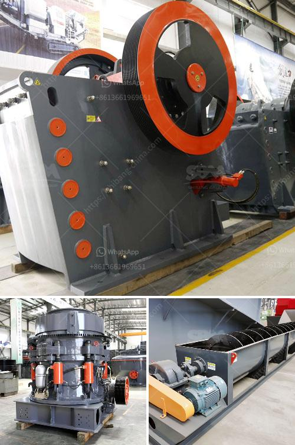

<h3>stone crusher for agriculture</h3>
Stone crushers are essential machines in the field of agriculture, as they help to recycle the waste stones and rocks found on the farmland, and convert them into a useful and productive resource. Stone crushers are considered as essential machines in the agricultural process. The stone crusher is commonly used for crushing boulders or other solid materials and aims at grinding the large stones into smaller pieces to be used in agricultural or construction purposes.

The stone crusher is made up of multiple elements such as grid plate, impact plate, machine body, and other parts. There are multiple possibilities of wearing parts for the machine, so users may easily replace components that are damaged or vulnerable. Different stone crushers have different attributes that suit various farming needs.

One of the key components of stone crushing machines is the spar, which is a resilient material that helps to remove the excessive shock or strain from the machine parts. Using spars ensures that the machine parts last longer and allows for easy maintenance. Crushers with sharp tools have the potential to quickly pulverize rocks, turning them into a useful product for farmers.

The stones are ground down and mixed with organic matter, thereby creating a beneficial mixture that can be used to improve the soil fertility on farms. Additionally, these crushed stones can also be used as a base material for building or roads. Therefore, stone crushers play an important role in the agriculture sector and the overall economy of a country.

In conclusion, stone crushers are the key equipment used in agriculture, which helps to recycle the waste stones and rocks found on farmland for various purposes. They are essential machines for farmers, as the crushed stones can be utilized to improve the soil fertility and increase agricultural productivity. The availability of different stone crusher models allows farmers to choose the most suitable machine according to their specific needs. With the continuous advancement in the agricultural sector, stone crushers are expected to become even more specialized and efficient in the near future.
<h3>Contact us</h3><ul><li><strong>Whatsapp:&nbsp;<a href="https://wa.me/8613661969651">+8613661969651</a></strong></li><li><a href="https://swt.shibang-china.com/?git&amp;zhl&amp;stone crusher for agriculture"><strong>Online Service(chat now)</strong></a></li></ul><h3>Related</h3><ul><li><a href='iron processing equipment cost.md'>iron processing equipment cost</a></li><li><a href='grinder for milling price in india.md'>grinder for milling price in india</a></li><li><a href='stone crusher to buy in bangalore.md'>stone crusher to buy in bangalore</a></li><li><a href='chrome mining business plan.md'>chrome mining business plan</a></li><li><a href='iron ore crusher for sale.md'>iron ore crusher for sale</a></li></ul>