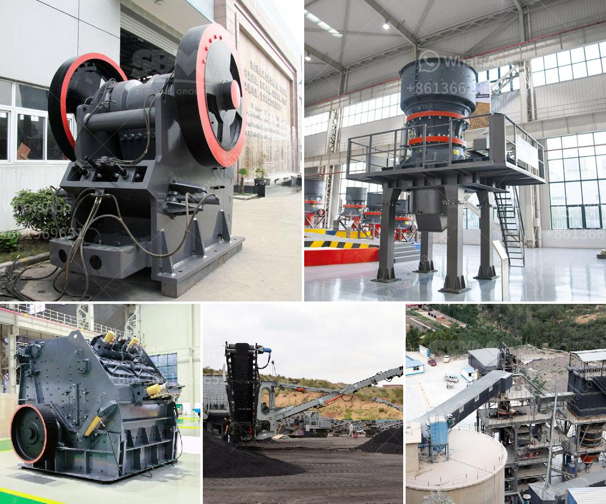

<h3>stone crusher for sale in zimbabwe</h3>
In recent years, Zimbabwe has been experiencing an economic crisis that has left the country with limited opportunities for development. To help address this issue, the government has prioritized infrastructure development and the mining sector, which has proven to be a crucial source of revenue. As a result, the demand for stone crushers for sale in Zimbabwe has increased significantly.

Stone crushers are key equipment that allows the smashing of rock material into various sizes. It is used in the mining, construction, and chemical industries and works by compressing and crushing the material between an eccentrically rotating piece of steel, called the mantle, and a stationary piece of steel, called the bowl.

There are several types of stone crushers available in Zimbabwe, including jaw crushers, cone crushers, and impact crushers. Each type has its own unique features and benefits. Here are some factors to consider when choosing a stone crusher for sale in Zimbabwe.

Firstly, the type and hardness of the material to be crushed should be considered. Harder materials will require a stronger impact force and a more durable crusher. Jaw crushers are well-suited for handling softer materials, while cone crushers and impact crushers are better for harder and more abrasive materials.

Secondly, the required output size of the crushed material should also be taken into account. Different crushers have different size reduction capabilities, so it's essential to choose a crusher that can meet the specific needs of the project. Jaw crushers are commonly used for primary crushing and can produce output sizes ranging from 40mm to 150mm. Cone crushers are useful for secondary crushing and can produce output sizes of 10mm to 50mm. On the other hand, impact crushers are suitable for tertiary crushing and can produce output sizes as fine as 0-5mm.

Lastly, the price and availability of spare parts should be considered. Stone crushers are machines that require regular maintenance and repairs, and having access to spare parts is crucial for uninterrupted operation. It's advisable to choose a stone crusher for sale in Zimbabwe from a reputable manufacturer that offers good after-sales support.

In conclusion, the demand for stone crushers in Zimbabwe is increasing and the government is prioritizing infrastructure development and the mining sector. Therefore, investing in a stone crusher for sale in Zimbabwe will be a profitable venture. However, choosing the right crusher can be a challenge, especially for those who are new in the business. If you consider the factors mentioned above and conduct thorough research, you can find the perfect stone crusher that suits your needs and budget.
<h3>Contact us</h3><ul><li><strong>Whatsapp:&nbsp;<a href="https://wa.me/8613661969651">+8613661969651</a></strong></li><li><a href="https://swt.shibang-china.com/?git&amp;zhl&amp;stone crusher for sale in zimbabwe"><strong>Online Service(chat now)</strong></a></li></ul><h3>Related</h3><ul><li><a href='cement mill operation manual.md'>cement mill operation manual</a></li><li><a href='mobile crushers quarry plant south africa.md'>mobile crushers quarry plant south africa</a></li><li><a href='zimbabwe mobile crusher rentals.md'>zimbabwe mobile crusher rentals</a></li><li><a href='kaolin crusher manufacturers in uk.md'>kaolin crusher manufacturers in uk</a></li><li><a href='white clay crusher process.md'>white clay crusher process</a></li></ul>