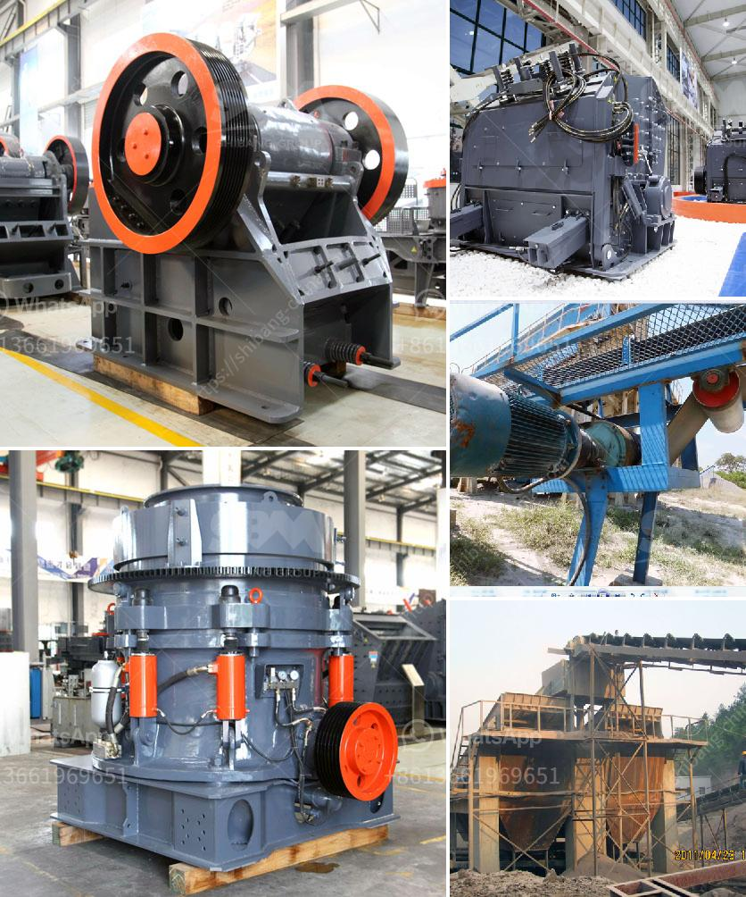

<h3>stone crusher for sales in south philippines</h3>
Stone crusher plant sale is booming in South Philippines. This is because of the growing demand for aggregate materials such as gravel, sand, and crushed stones for construction purposes. Due to the lucrative mineral reserves in the region, local authorities have provided various incentives to encourage stone crusher plant sales.

Stone crushers are vital pieces of equipment that aid in breaking down huge chunks of rock into manageable sizes. These machines have revolutionized the construction industry, making it possible to produce aggregates at a faster rate. Stone crushers come in different models and sizes, and their ability to crush hard stones and other materials efficiently makes them suitable for several construction projects.

The South Philippines region, in particular, has experienced a rapid increase in infrastructure development projects. This has created a significant demand for stone crushers in the area. Growing urbanization has led to the need for quality construction materials in the form of aggregates. Stone crushers play a vital role in this supply chain by producing the necessary materials required for construction projects.

The stone crusher industry in South Philippines has grown rapidly due to multiple factors. Firstly, an abundant supply of raw materials has made it easier for manufacturers to meet the demand. Secondly, technological advancements have made these machines more efficient and cost-effective, resulting in increased sales. Additionally, stringent environmental regulations have pushed the market towards sustainable solutions, leading to the popularity of stone crushers as they produce less pollution compared to traditional methods of aggregate production.

The stone crusher business in South Philippines is poised for further growth as the government plans to invest heavily in infrastructure development projects in the coming years. These projects will require a significant amount of aggregate materials, which will boost the demand for stone crushers. Entrepreneurs looking to capitalize on this increasing demand have a lucrative opportunity to invest in stone crusher plants in South Philippines.

In conclusion, the stone crusher business in South Philippines is on the rise due to the growing demand for quality construction materials. Stone crushers play a vital role in meeting this demand and contribute to the overall development of the construction industry. With the government's focus on infrastructure development, the stone crusher market is expected to continue its upward trend. Entrepreneurs should seize this opportunity and invest in stone crusher plants in South Philippines to capitalize on the growing market.
<h3>Contact us</h3><ul><li><strong>Whatsapp:&nbsp;<a href="https://wa.me/8613661969651">+8613661969651</a></strong></li><li><a href="https://swt.shibang-china.com/?git&amp;zhl&amp;stone crusher for sales in south philippines"><strong>Online Service(chat now)</strong></a></li></ul><h3>Related</h3><ul><li><a href='business plan for gold mining company in zimbabwe.md'>business plan for gold mining company in zimbabwe</a></li><li><a href='quarry equipment sale in usa.md'>quarry equipment sale in usa</a></li><li><a href='mobile crushing plant canada.md'>mobile crushing plant canada</a></li><li><a href='coal washing plant suppliers.md'>coal washing plant suppliers</a></li><li><a href='new quartz plant cost in india.md'>new quartz plant cost in india</a></li></ul>