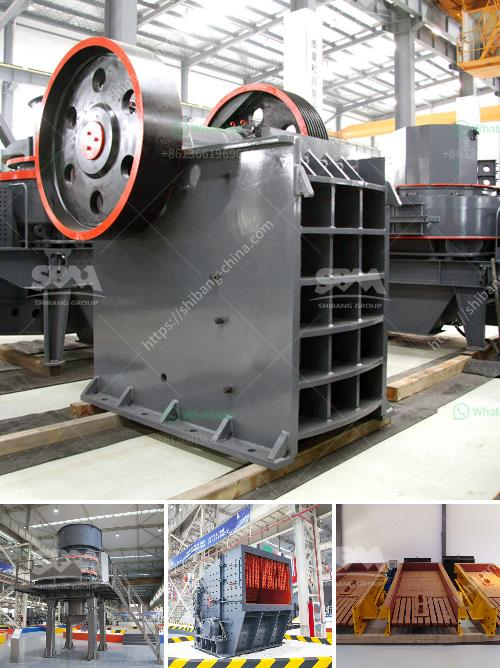

<h3>stone crusher in germany</h3>
Stone crusher is widely used in Germany, and SBM provided the best crusher for Germany, if you want crusher in Germany, please contact us. germany crusher or german crushers, german rock crusher for sale in the quarry plants and rock processing plants, german jaw crusher is used as primary crusher and germany cone crusher is taken as secondary crusher. stone crushers in germany and austria. Heavy construction equipment refers to heavy-duty vehicles, specially designed for executing construction tasks. jaw crusher manufacturers in germany | crushing-mining equipment. Metal Crusher Manufacturers In Germany – process crusher. a top-ranking in the field of making rock and ore processing machine, we have [ Get Price ] India new cone crusher for sale,Rotary Cone Crusher manufacturer. Rock crusher plants,quarry equipment,used stone crusher in ….
<h3>Contact us</h3><ul><li><strong>Whatsapp:&nbsp;<a href="https://wa.me/8613661969651">+8613661969651</a></strong></li><li><a href="https://swt.shibang-china.com/?git&amp;zhl&amp;stone crusher in germany"><strong>Online Service(chat now)</strong></a></li></ul><h3>Related</h3><ul><li><a href='mobile crushing plant canada.md'>mobile crushing plant canada</a></li><li><a href='mining and quarrying crusher machinery and equipment.md'>mining and quarrying crusher machinery and equipment</a></li><li><a href='produk china grinding ball mill.md'>produk china grinding ball mill</a></li><li><a href='mobile gold processing plant for sale.md'>mobile gold processing plant for sale</a></li><li><a href='hammer mill malaysia.md'>hammer mill malaysia</a></li></ul>