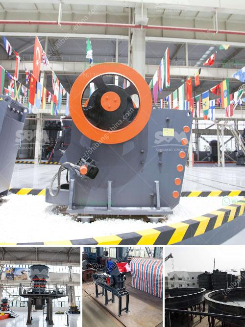

<h3>stone crusher in mexico</h3>
Stone crusher, also known as rock crusher, is a necessary equipment in the mining machinery industry. The widespread use of stone crushers in Mexico is due to the crushing principle, efficiency, and performance advantages of these machines. Mexico is rich in mineral resources, such as iron ore, copper ore, gold ore, nonferrous metal ore, limestone, granite, basalt, sandstone, pebbles, etc.

Stone crushers are widely used in the crushing of various ore and bulk materials. The compressive strength of materials is not higher than 320MPa, and the maximum feed size is 1200mm. The types and models of crushers are also diverse, mainly including jaw crushers, impact crushers, cone crushers, and hammer crushers.

Jaw crusher, as a common coarse crushing equipment, has large crushing ratio, high crushing efficiency, and low energy consumption. It is favored by users due to its simple structure and reliable performance. Impact crusher is generally used for secondary crushing, with a large feed inlet and a strong crushing capacity. Cone crusher is mainly used for medium and fine crushing, with high crushing efficiency and good grain shape. Hammer crusher is suitable for crushing brittle materials with medium hardness and low water content.

In Mexico, rock crushers are widely used in many industries, such as mining, smelting, building materials, highways, railways, water conservancy, and chemical industries. The most commonly used stone crushers are jaw crushers, impact crushers, and cone crushers. Jaw crushers are usually used in primary crushing, and impact crushers and cone crushers are used in secondary crushing.

With technological advances and increasing demands, stone crushers are also developing towards large-scale, automated, and intelligent. Companies in Mexico are constantly researching and developing new crushers to meet the needs of the market. China, as a major player in the mining machinery industry, has contributed to the development of stone crushers in Mexico by providing advanced crushing technologies and equipment.

In conclusion, stone crushers are essential equipment in Mexico's mining industry. The development of stone crushers is driven by the increasing demand for sand and gravel aggregate, as well as the development of infrastructure in Mexico. The mining machinery industry in Mexico should continue to innovate and improve its production capacity to meet the growing needs of the country.
<h3>Contact us</h3><ul><li><strong>Whatsapp:&nbsp;<a href="https://wa.me/8613661969651">+8613661969651</a></strong></li><li><a href="https://swt.shibang-china.com/?git&amp;zhl&amp;stone crusher in mexico"><strong>Online Service(chat now)</strong></a></li></ul><h3>Related</h3><ul><li><a href='production grinding mill europe.md'>production grinding mill europe</a></li><li><a href='conveyor equipment in tanzania.md'>conveyor equipment in tanzania</a></li><li><a href='indonesia copper processing equipment for sale.md'>indonesia copper processing equipment for sale</a></li><li><a href='calcium carbonate plant sell in india.md'>calcium carbonate plant sell in india</a></li><li><a href='coal crusher 350tph.md'>coal crusher 350tph</a></li></ul>