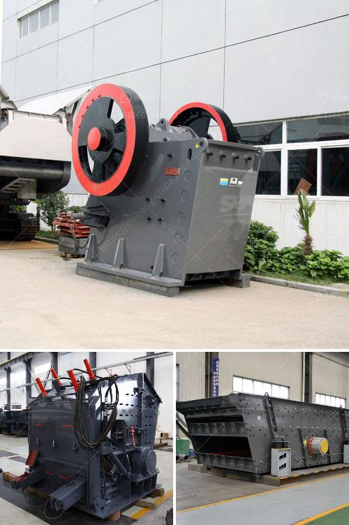

<h3>stone crusher in subic</h3>
The stone crusher in Subic is a strong and reliable machine that combines advanced technology with the latest manufacturing techniques to ensure optimal performance and crushing results. The Subic crusher is built with a heavy-duty structure and has been designed to withstand the toughest working conditions in the mining industry.

One of the key features of the Subic crusher is its high crushing efficiency. With a large crushing ratio and a deep crushing chamber, the machine can effectively crush large rocks and reduce them into smaller, more manageable sizes. This not only increases productivity but also reduces the need for additional crushing stages, saving time and resources.

The Subic crusher is also equipped with a powerful motor that provides efficient and consistent crushing power. This ensures that the machine can handle even the hardest and toughest materials, including granite, limestone, and basalt. The motor also helps to minimize energy consumption, making the Subic crusher an environmentally friendly choice.

In addition to its reliable performance, the Subic crusher is also easy to operate and maintain. The machine features a user-friendly control panel that allows operators to adjust the settings and monitor the crushing process. It also has a hydraulic system that enables quick and easy adjustments of the crusher gap, ensuring optimal product size and shape.

Safety is also a top priority in the design of the Subic crusher. The machine is equipped with various safety features, including a safety lock system that prevents unauthorized access to the crushing chamber and a safety brake system that stops the machine in case of an emergency. These features help to ensure the wellbeing of operators and reduce the risk of accidents.

The versatility of the Subic crusher is another notable feature. It can be used in various applications, including road construction, building construction, and mining operations. The machine can crush different types of rocks, including hard and soft rocks, and produce different sizes of aggregates for different uses.

Overall, the stone crusher in Subic offers a reliable and efficient solution for crushing rocks and producing high-quality aggregates. Its advanced technology, durability, and ease of use make it a valuable asset in the mining industry. Whether it is used in quarrying or construction projects, the Subic crusher is a reliable choice that ensures optimal crushing results and long-term performance.
<h3>Contact us</h3><ul><li><strong>Whatsapp:&nbsp;<a href="https://wa.me/8613661969651">+8613661969651</a></strong></li><li><a href="https://swt.shibang-china.com/?git&amp;zhl&amp;stone crusher in subic"><strong>Online Service(chat now)</strong></a></li></ul><h3>Related</h3><ul><li><a href='cost gravel crusher.md'>cost gravel crusher</a></li><li><a href='crusher price rock crusher price 8mm.md'>crusher price rock crusher price 8mm</a></li><li><a href='quick lime powder making machine.md'>quick lime powder making machine</a></li><li><a href='hammer mill grinder thailand.md'>hammer mill grinder thailand</a></li><li><a href='crusher santa marta malaysia.md'>crusher santa marta malaysia</a></li></ul>