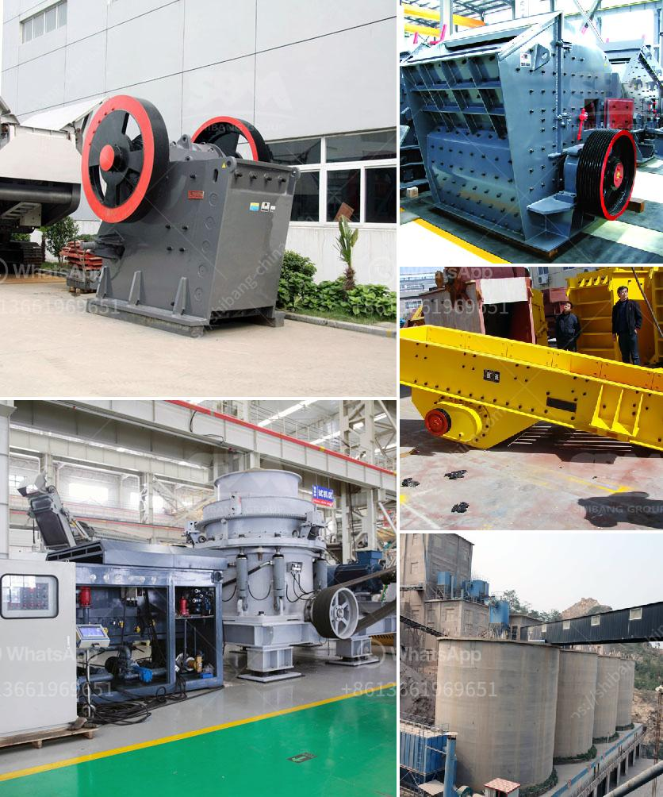

<h3>stone crusher in usa</h3>
Stone crusher in USA is used as crushing machine mainly for crushing rocks into small pieces for building aggregates and sand gravel production. SBM can offer jaw crusher, cone crusher, sand making machine and other core crushers for sale. With the robust growth of mining and construction industry, the stone crushing market is poised to experience surge in demand for crushers used in the USA in the near future.

The machine uses high-strength materials, advanced manufacturing technology, a variety of models, and has the advantages of simple and reasonable structure, high productivity, easy operation, and maintenance. It has been widely used in the metallurgy, mining, chemical, cement, coal, sand and gravel industry to reduce the size of rocks, stones, minerals, and ores.

In the USA, stone crushers are used for crushing stones into small pieces for brick manufacturing, construction purposes, and railway ballast. Stone crushing machine is used to crush large-sized rocks into fragments by the ways of extruding, splitting, bending, impacting, and rolling. Commonly used stone crushers include jaw crusher, cone crusher, impact crusher, roller crusher, hammer crusher, etc.

The quality of the product is always the key to success. Each stone crusher machine has different functions and produces different results depending on the different material types. Some stone crushers are stable and great, but some are terrible. Today, I will tell you what kinds of stone crusher worth to choose and how to choose.

1. Jaw Crusher: It crushes large-sized stones into smaller ones, and the inlet and outlet are relatively large. It is a primary crusher. Crushing ration is large, durable, simple structure, stable operation. Jaw crusher is divided into coarse and fine broken two stage crushing machine for mine, plastic, cement, building materials and other industrial sectors.

2. Impact Crusher: Impact crusher mainly relies on the interaction of high-speed rotating wear-resistant hammer head and lining plate. The crushing cavity is designed with a feeding port, which can smoothly transport materials into the crusher, saving time and reducing energy consumption.

3. Cone Crusher: Cone crusher adopts the principle of laminated crushing to form a protective layer of material layer, which not only reduces wear and prolongs the service life, but also realizes the selective crushing of materials and greatly improves the smashing efficiency.

4. Roller Crusher: This crusher is mainly composed of roller wheel, roller supporting bearing, pressing and regulating device and driving device. It can crush large and hard stones into small pieces with adjustable discharge size.

To choose the right stone crusher, we should not only look at the price but also choose the crusher according to the performance, efficiency, production capacity, product quality, energy consumption, and maintenance cost, etc.

Finally, you can choose suitable crusher machine according to your actual needs. The crushers in the USA market are various, including jaw crusher, impact crusher, cone crusher, roller crusher, etc., which are developed by experienced and professional engineers. If you are interested in stone crusher, welcome to check and buy from SBM, one of the leading stone crusher suppliers in USA.
<h3>Contact us</h3><ul><li><strong>Whatsapp:&nbsp;<a href="https://wa.me/8613661969651">+8613661969651</a></strong></li><li><a href="https://swt.shibang-china.com/?git&amp;zhl&amp;stone crusher in usa"><strong>Online Service(chat now)</strong></a></li></ul><h3>Related</h3><ul><li><a href='ball mill 5kg capacity price.md'>ball mill 5kg capacity price</a></li><li><a href='talc powder crushers.md'>talc powder crushers</a></li><li><a href='ballast crusher price.md'>ballast crusher price</a></li><li><a href='quartz manufacturing process from mineral.md'>quartz manufacturing process from mineral</a></li><li><a href='ton day cement clinker grinding plant.md'>ton day cement clinker grinding plant</a></li></ul>