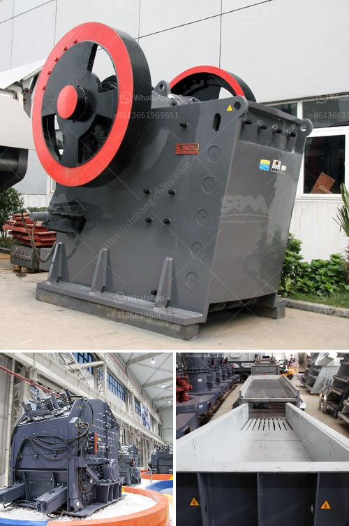

<h3>stone crusher machine for hire in mpumalanga</h3>
Stone crusher machine for hire in Mpumalanga is a useful resource for anyone from small-scale contractors to large enterprises in need of heavy-duty machinery. Being Mpumalanga's sole distributor of Komatsu, Zizwe-Opencast Mining offers a broad range of stone crusher machines that work meticulously to ensure maximum productivity and reliability.

When it comes to crushing rocks and stones, the stone crusher machine is indispensable. It is highly flexible and designed to meet the needs of various industries, such as mining, construction, and more. With its powerful crushing capabilities, it can reduce large chunks of raw materials into smaller, more manageable sizes.

The stone crusher machine for hire in Mpumalanga offers a wide variety of equipment to suit different crushing needs. These include:

1. Jaw Crusher: This type of rock crusher is ideal for primary crushing. It has a strong and sturdy structure that ensures efficient and effective crushing of the toughest materials. It is often used in mining operations and construction sites.

2. Cone Crusher: A cone crusher is suitable for secondary or tertiary crushing. It works by compressing the material between an eccentrically gyrating spindle and a concave hopper. This machine is widely used in the mining and construction industry.

3. Impact Crusher: If you need a machine capable of producing high-quality and well-graded materials, an impact crusher is an excellent choice. It uses impact force to crush stones, making it ideal for materials with medium hardness.

4. Mobile Crusher: For those working on multiple sites or requiring flexibility, a mobile crusher is a practical option. This machine can be easily transported from one location to another, allowing you to crush stones and rocks on-site. It is especially useful for road construction projects.

When hiring stone crusher machines in Mpumalanga, it is important to consider various factors to ensure maximum efficiency and profitability. These include:

1. Machine Condition: Ensure that the machine you hire is in excellent working condition. This includes checking the engine, hydraulics, and all other components. A well-maintained machine ensures fewer breakdowns and increased productivity.

2. Maintenance and Support: It is essential to choose a hiring company that offers ongoing maintenance and support for their machines. Regular maintenance will keep the machine running smoothly, and support will ensure prompt assistance in case of any issues.

3. Fuel Efficiency: Opt for machines that consume less fuel without compromising their performance. Fuel-efficient machines can help reduce operating costs and minimize environmental impact.

4. Training: When hiring stone crusher machines, it is crucial to ensure that the operator receives proper training on how to operate the machine safely and efficiently. This will not only protect the operator but also maximize productivity.

In conclusion, stone crusher machines for hire in Mpumalanga offer a range of equipment options to suit various crushing needs. Considering factors such as machine condition, maintenance and support, fuel efficiency, and training will help ensure a successful and efficient operation.
<h3>Contact us</h3><ul><li><strong>Whatsapp:&nbsp;<a href="https://wa.me/8613661969651">+8613661969651</a></strong></li><li><a href="https://swt.shibang-china.com/?git&amp;zhl&amp;stone crusher machine for hire in mpumalanga"><strong>Online Service(chat now)</strong></a></li></ul><h3>Related</h3><ul><li><a href='diamond jaw crusher usa.md'>diamond jaw crusher usa</a></li><li><a href='crusher used for copper ore.md'>crusher used for copper ore</a></li><li><a href='second hand ball mill and gauteng.md'>second hand ball mill and gauteng</a></li><li><a href='manganese ball milling machine.md'>manganese ball milling machine</a></li><li><a href='portalble stone crusher.md'>portalble stone crusher</a></li></ul>