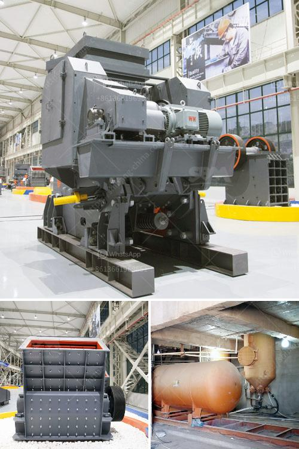

<h3>stone crusher machine for sale ethiopia</h3>
In the era of rapid economic development, infrastructure construction is essential. Stone crushing machine is indispensable equipment in the construction industry. Stone crushing machine refers to the machinery that crushes stone to small particle size for building aggregates.

Different types of stone crushers, such as hammer crusher, impact crusher, and jaw crusher, are often used in the construction industry. These are used for crushing large blocks of stones into smaller pieces, which, in turn, are processed into concrete or asphalt.

Ethiopia makes great strides in construction projects such as dams, roads, bridges, buildings, and railways. Industries related to stone crushing have been flourishing in this region for over a decade now, especially due to the booming construction activities in the country.

The stone crushers are widely used in various fields in Ethiopia, such as the construction of highways, railways, buildings, and bridges, etc. Due to the rapid development of the construction industry in recent years, it has driven the development of many industries such as mining, cement, water conservancy, and construction.

Stone crushers have many types and models, such as mobile crushers, jaw crushers, impact crushers, cone crushers, and vertical shaft impact crushers, etc. Different types have different crushing capabilities and efficiency. Therefore, depending on the actual production requirements, the appropriate stone crusher machine is selected.

For instance, such hard materials as granite, basalt, silexite, magnetite etc. can be crushed fine with fine jaw crusher ,researched and developed with the National Mining and Metallurgy Community, which enjoys a one-up place in the world because of its significant breakthrough in hard rock crushing.

And the demand for aggregates in Ethiopia is increasing due to the rapid urbanization. Ethiopia's government has therefore developed various policies to meet this ever-growing demand. The Ethiopian government has set aside billion birr for the construction of infrastructure projects, according to the Ethiopian Road Authority (ERA). This has stimulated the demand for stone crushing equipment, and contractors are now looking for efficient stone crushers that can meet their production requirements.

In recent years, a considerable number of stone crushers in Ethiopia have emerged, of which the following is a typical example:

The jaw crusher is used for primary crushers and secondary crushers for crushing all kinds of minerals and rocks with compressive strength less than 320 mpa. There are two types of jaw crusher: coarse jaw crusher and fine jaw crusher.

The jaw crusher is a machine used to crush stones and other hard materials, so it has been widely used in domestic and international markets and has won the favor of many customers.

300-500tph iron ore processing equipment are widely used in highway, railway, bridge, and all kinds of construction projects. If you are looking for a stone crusher machine for sale, this is the right place for you. We are a professional manufacturer and supplier of mining machinery, including stone crusher, grinding mill, sand making machine, beneficiation machine, and other associated machines. Our products have been sold to more than 160 countries and areas around the world. Our dedicated technical team can provide you with professional support and guidance. Contact us now for more information!
<h3>Contact us</h3><ul><li><strong>Whatsapp:&nbsp;<a href="https://wa.me/8613661969651">+8613661969651</a></strong></li><li><a href="https://swt.shibang-china.com/?git&amp;zhl&amp;stone crusher machine for sale ethiopia"><strong>Online Service(chat now)</strong></a></li></ul><h3>Related</h3><ul><li><a href='coal handling plant maintenance pdf.md'>coal handling plant maintenance pdf</a></li><li><a href='mineral processing calculations pdf.md'>mineral processing calculations pdf</a></li><li><a href='ballast stone crusher.md'>ballast stone crusher</a></li><li><a href='milling machine of jaw crusher.md'>milling machine of jaw crusher</a></li><li><a href='industrial impact crushers.md'>industrial impact crushers</a></li></ul>