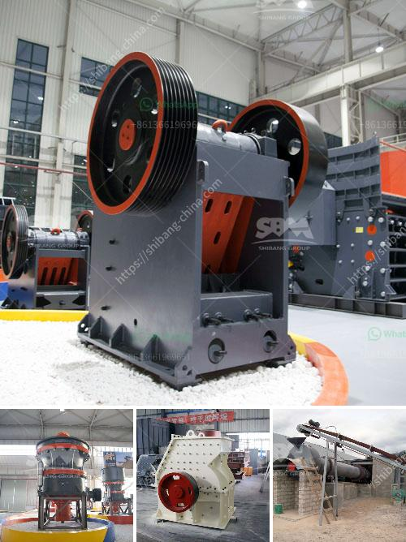

<h3>stone crusher machine for sale in kenya</h3>
Rock machines for sale have widely applications in many fields, such as metallurgy, mining, chemical, construction industries and so on. The rock crushing machines are always used for crushing all kinds of stones, such as limestone, granite, bauxite, mica and so on.In the actual rock mining plant in Kenya, the stone crusher machine for sale is always used in the first processing stage for dealing with the large size raw materials.

When the materials are processed into required size for the next processing stage, they are sent to other mining machines for further processing, such as in mining industry, jaw crusher is the most common used primary crushing machine. It is mainly used for coarse crushing process of the raw materials. In the mineral processing plant, it is often necessary to have the material to be crushed processed into smaller sizes for further processing.

Crushing is the integral step in stone processing operation. Stone crushing operation is generally processed in three stages: primary crushing, secondary crushing and tertiary crushing. Each crushing stage involves different types of stone crusher and produces different particle sizes. Stone crusher plant prices are different according to different types and production capacity.

The feeder or screens separate largeboulders from finer rocks that do not require primary crushing, thus reducing the load to theprimary crusher. Jaw crusher, impact crusher, or gyratory crushers are usually used forprimary size reduction.The stone that is too large to pass through the top deck ofthe scalping screen is processed in the secondary crusher. Cone crushers are commonly used forsecondary crushing. Tertiary crushing is usually performed using cone crushers or other types of impactcrushers.

With the increasing urbanization and rapid development of infrastructure construction, the demand for stone crusher plant is also increasing, especially the requirement for the gravel aggregate. So, the investment in stone crusher plants has been increased, attracting more and more people to invest.

SBM is a professional manufacturer and exporter of mining equipment, such as: crushing plant, mobile crushers, grinding mill machine, feeding & conveyor, screening & washing, beneficiation equipment, stone crusher machine for sale in Kenya, etc. For more than 20 years, we have been dedicated to producing mining equipment, sand making machines and industrial grinding mills, offering expressway, rail way and water conservancy projects the solution of making high grade sand and matched equipment.
<h3>Contact us</h3><ul><li><strong>Whatsapp:&nbsp;<a href="https://wa.me/8613661969651">+8613661969651</a></strong></li><li><a href="https://swt.shibang-china.com/?git&amp;zhl&amp;stone crusher machine for sale in kenya"><strong>Online Service(chat now)</strong></a></li></ul><h3>Related</h3><ul><li><a href='bentonite powder plant in surat.md'>bentonite powder plant in surat</a></li><li><a href='roll crusher price.md'>roll crusher price</a></li><li><a href='best stone crusher from south africa.md'>best stone crusher from south africa</a></li><li><a href='iron ore 100 150tph belt conveyor price.md'>iron ore 100 150tph belt conveyor price</a></li><li><a href='south africa ballast crushing companies.md'>south africa ballast crushing companies</a></li></ul>