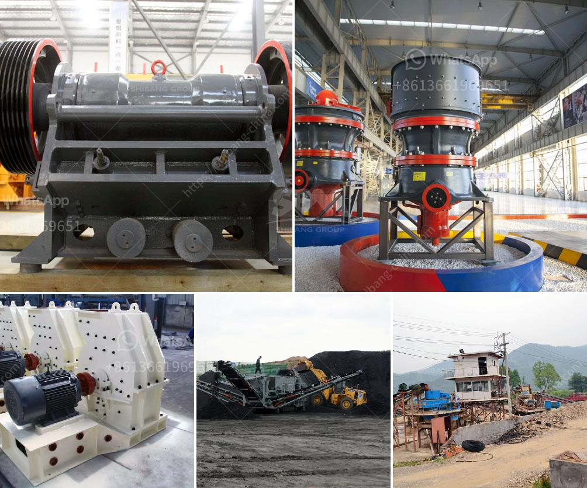

<h3>stone crusher machine in south africa</h3>
South Africa is endowed with various types of mineral resources. To finance the mining activities, mining is a lucrative enterprise which has made mining one of the most important industrial sectors in South Africa. The country is also known for its abundance of diamond, platinum, gold, coal, and iron ore.

In recent years, the demand for stone crusher machines in South Africa has increased significantly due to the rapid development of the mining industry. As a result, the stone crusher machines are in high demand and companies producing them have been thriving due to the high demand.

With the increase in demand for stone crusher machines in South Africa, industries have been booming. South Africa has vast quantities of minerals which ensure the efficient operation of mining industries. More importantly, mineral resources play a significant role in the economic growth of South Africa. Stone crusher machines are used to crush large stones into smaller size or change the form such as limestone, quartz, marble, granite, and recycle building waste materials such as debris, asphaltic cement concrete.

Due to the wide application of stone crusher machines in South Africa, the market competition is fierce. To increase the market share and improve the overall competitiveness, companies have to continuously innovate and develop new products. The stone crusher machine manufacturers in South Africa have been focusing on the development of crushers more than 50 years.

The development of stone crusher machines in South Africa is very rapid. With the rapid development of South Africa's economic and social status, stone crusher machine manufacturers have also increased. Between the competition of stone crusher machine manufacturers and the equipment itself, the price advantage has been reduced. Therefore, the quality of stone crusher machines in South Africa is strict, Germany is a very rich country in mineral resources. Its mining industry is booming, which makes the market for stone crusher machines in Germany flourish.

Over the years, China has always been South Africa's largest trading partner in mining machinery and stone crusher machines. However, with the implementation of the "Belt and Road Initiative," China's position in the South African machinery market has gradually increased.

With the development of infrastructure construction, various types of stone crusher machines have been widely used. In order to obtain high-quality products, it is necessary to use different types of stone crushers. The stone crusher machines produced by the manufacturers are increased in volume. Therefore, the competition among manufacturers of stone crusher machines is quite fierce.

In summary, the mining industry in South Africa is growing fast, making it a major contributor to the economy in the country. Stone crusher machines play an important role in the development of South Africa's infrastructure, such as mining, construction, water conservancy, and railways. Considering the market demand and the increasing market competition, companies should seize the opportunities and develop high-quality crushing equipment to meet the needs of customers.
<h3>Contact us</h3><ul><li><strong>Whatsapp:&nbsp;<a href="https://wa.me/8613661969651">+8613661969651</a></strong></li><li><a href="https://swt.shibang-china.com/?git&amp;zhl&amp;stone crusher machine in south africa"><strong>Online Service(chat now)</strong></a></li></ul><h3>Related</h3><ul><li><a href='hammer mill malaysia.md'>hammer mill malaysia</a></li><li><a href='fly ash grinding machine manufacturar in india.md'>fly ash grinding machine manufacturar in india</a></li><li><a href='barium carbonate manufacturing process.md'>barium carbonate manufacturing process</a></li><li><a href='bentonite processing plant in maharashtra.md'>bentonite processing plant in maharashtra</a></li><li><a href='coal crusher supplier.md'>coal crusher supplier</a></li></ul>