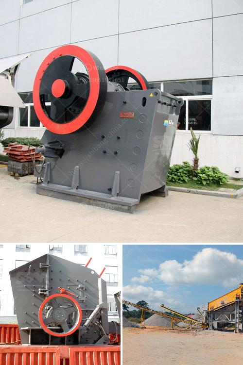

<h3>stone crusher machine japan</h3>
Stone crusher machines have been developed very well in Japan. Since the establishment of Japanese industry, minerals and ores have been extracted from the mines and processed by the stone crusher machines. Japan is one of the leading countries in manufacturing and exporting industries. It was ranked 3rd in the world in terms of automobile manufacturing industry, electrical machinery industry, and so on. Japan has rich mineral resources such as gold, copper, iron ore, etc. Many of the mineral resources are localized and located in mountains or near rivers.

Crushed stones are used as raw materials for construction, infrastructure, and other industries. Japan is a mountainous country, so the stones are utilized to build roads, bridges, houses, and other structures. Japan's building and road construction industries are very advanced and have a high demand for stone crusher machines.

In recent years, Japan has introduced advanced technologies and equipment in mining equipment and crushing equipment, such as crushing machines with hydraulic systems, cone crushers, tramp release systems, and sand making machines. In addition, many manufacturers in Japan offer innovative products and technologies that are eco-friendly and energy-efficient.

Stone crusher machines in Japan are widely used in large and medium-sized construction projects. Some people may wonder why Japanese companies choose to purchase these machines from overseas suppliers and not from domestic suppliers. It is mainly because of the high cost and limited selection of domestically produced machines. Japanese companies also value the advanced technology and superior quality offered by foreign manufacturers.

To conclude, stone crusher machines have played a crucial role in the construction industry in Japan. They facilitate the production of high-quality crushed stones and other raw materials. Japan is one of the world's leading industrialized nations, and its stone crusher machines reflect its dedication to technology, quality, and innovation.
<h3>Contact us</h3><ul><li><strong>Whatsapp:&nbsp;<a href="https://wa.me/8613661969651">+8613661969651</a></strong></li><li><a href="https://swt.shibang-china.com/?git&amp;zhl&amp;stone crusher machine japan"><strong>Online Service(chat now)</strong></a></li></ul><h3>Related</h3><ul><li><a href='gypsum board manufacturing.md'>gypsum board manufacturing</a></li><li><a href='granite impact crusher.md'>granite impact crusher</a></li><li><a href='lay out calcium carbonate plant.md'>lay out calcium carbonate plant</a></li><li><a href='aggregate crushing plant sale.md'>aggregate crushing plant sale</a></li><li><a href='composition of ball mill liner.md'>composition of ball mill liner</a></li></ul>