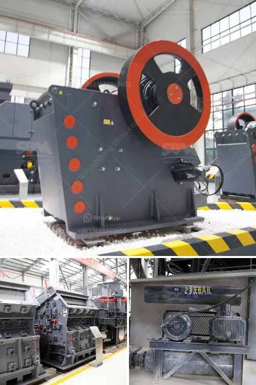

<h3>stone crusher machine price in bangladesh</h3>
In the era of modern technology, the internet is constantly being used worldwide to access information, including goods, equipment, and machines. Stone crusher is one of such machines that are used for construction purposes, as well as mining operations, generally employed to reduce the size of raw materials (stones or rock) into smaller and more manageable sizes. This machine is durable and designed with advanced technology to provide precise operation and high crushing ratio, giving users a remarkable experience.

The price range of these machines can vary depending on their capacity, features, and brand. However, it is fair to say that prices typically range between $70,000 and $200,000. Moreover, some machines require additional equipment and components, which add to the overall cost. Thus, factors like capacity, size of input and output materials, ease of maintenance, and availability of spare parts should all be considered before making a purchase.

One of the factors contributing to the stone crusher machine price in Bangladesh is its low maintenance cost. This is due to the presence of a wide range of spare parts available, which ensures that even minor faults get repaired quickly. If any issue occurs, the user can easily replace the damaged parts with the new ones. These machines are also built with durability in mind, ensuring that they can withstand harsh conditions for a prolonged period.

Another factor influencing the price is the capacity of the stone crusher machine. Smaller capacity machines tend to cost less as they require less energy and typically have a lower production rate. However, high-capacity machines are incredibly efficient and provide greater output based on the volume of materials crushed per hour. It is essential to determine the required capacity based on the intended usage to make an informed decision.

Furthermore, the overall design and technology present in the stone crusher machine greatly impact its price. Advanced features and high-tech materials ensure enhanced performance, resulting in higher costs. However, it is worth noting that investing in a machine with superior technology ultimately pays off due to its prolonged lifespan and increased productivity, saving more money in the long run.

In conclusion, the price of stone crusher machines in Bangladesh depends on various factors, including its capacity, design, and manufacturer. These are the top three factors responsible for determining the price of a stone crusher. With these factors considered, a comprehensive discussion about stone crusher machine price is essential to gain a clear understanding of the overall market. Additionally, comparing machines from different manufacturers ensures that buyers get the best product at the best price.
<h3>Contact us</h3><ul><li><strong>Whatsapp:&nbsp;<a href="https://wa.me/8613661969651">+8613661969651</a></strong></li><li><a href="https://swt.shibang-china.com/?git&amp;zhl&amp;stone crusher machine price in bangladesh"><strong>Online Service(chat now)</strong></a></li></ul><h3>Related</h3><ul><li><a href='cone crusher working.md'>cone crusher working</a></li><li><a href='new quartz plant cost in india.md'>new quartz plant cost in india</a></li><li><a href='mining equipment price in ghana.md'>mining equipment price in ghana</a></li><li><a href='quartz powder machine manufacturer in india.md'>quartz powder machine manufacturer in india</a></li><li><a href='quartz powder ball mill.md'>quartz powder ball mill</a></li></ul>