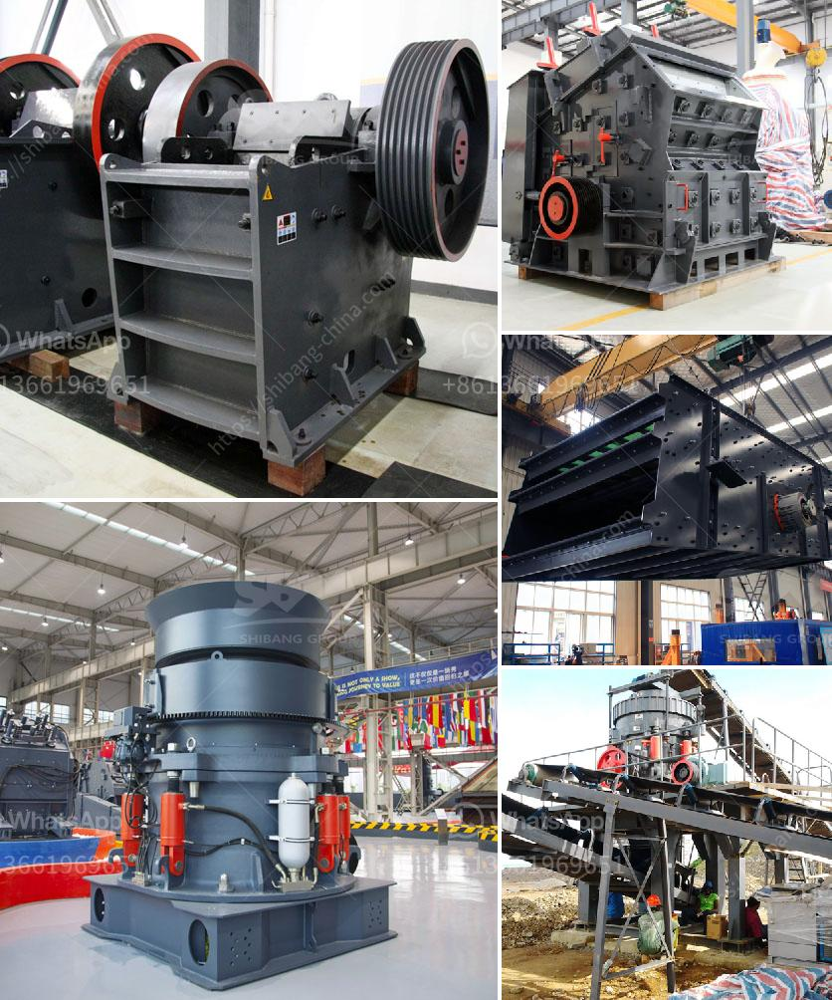

<h3>stone crusher machine price in south africa</h3>
Crusher for sale in South Africa is manufactured and supplied by a global leader in the crushing technology industry. SBM offer products with high quality and competitive price, which makes the crusher for sale in South Africa stand out from the other crushing equipment manufacturers.

In the market, there are various stone crusher machines, such as jaw crusher, counterattack crusher, vertical impact crusher, hydraulic cone crusher, hammer crusher, roll crusher, compound crusher, cone crusher, the two-stage crusher, gyratory crusher, mobile crusher, and so on. These types of crusher machines are widely used in different industries and have different functions.

The South Africa stone crusher is in the shape of a narrow and small rectangular opening. The crushed rock material is squeezed out from the bottom of the crushing chamber. When it is used, it will have a simple operation, convenient maintenance and adjustment, and a low price. It is used for crushing the intermediate and fine crushing brittle materials such as the medium ore with the hardness of the stone. It is an ideal equipment for industrial departments such as minerals processing, chemical industry, cement, building materials, refractory materials, and ceramics.

The price of the specific stone crusher machine will be affected by factors such as the crusher capacity, the required feeding size, the final size, the quarry situation, specific requirements for the stone crusher machine price, and other factors. So, what are the influencing factors for the price?

1. Model of the stone crusher machine. Different models have different prices. Therefore, when choosing a model, users should be familiar with the specific output, processing capacity, required feeding size, and discharge size requirements. According to the different models, the price of the crusher machine is also different.

2. Brand of the stone crusher machine. There are many brands of stone crusher machines in the market. The brand they choose will affect the machine price. Although some brand manufacturers will offer competitive prices, the quality and performance of the machines will not guarantee the same level.

3. Supply and demand situation. The supply and demand situation of the stone crusher machine will also influence the price. For example, some cities are just starting to develop, the market demand for stone crusher machines is still high, which causes the price of the machines to be relatively high, while in other places where the market demand is relatively saturated, the price will be relatively low.

4. After-sales service. Good after-sales service can directly affect the cost performance of the machine. If the after-sales service is perfect, users do not need to worry about the later maintenance and repair of the machine, which will largely reduce the additional costs of the whole machine.

In conclusion, the stone crusher machine price in South Africa will be affected by various factors, such as the crusher model, the brand, the supply and demand situation, the after-sales service, etc. We conclude that the price of the stone crusher machine is closely related to the model, brand, and quality of the machine. Therefore, we recommend that you do a market survey before purchasing, and we believe that you will purchase a cost-effective stone crusher machine.
<h3>Contact us</h3><ul><li><strong>Whatsapp:&nbsp;<a href="https://wa.me/8613661969651">+8613661969651</a></strong></li><li><a href="https://swt.shibang-china.com/?git&amp;zhl&amp;stone crusher machine price in south africa"><strong>Online Service(chat now)</strong></a></li></ul><h3>Related</h3><ul><li><a href='wet process of cement production.md'>wet process of cement production</a></li><li><a href='hammer mill for sale in zimbabwe.md'>hammer mill for sale in zimbabwe</a></li><li><a href='general hypothesis of jaw crusher.md'>general hypothesis of jaw crusher</a></li><li><a href='coal screening machine for sale in india.md'>coal screening machine for sale in india</a></li><li><a href='mining equipment made in germany.md'>mining equipment made in germany</a></li></ul>