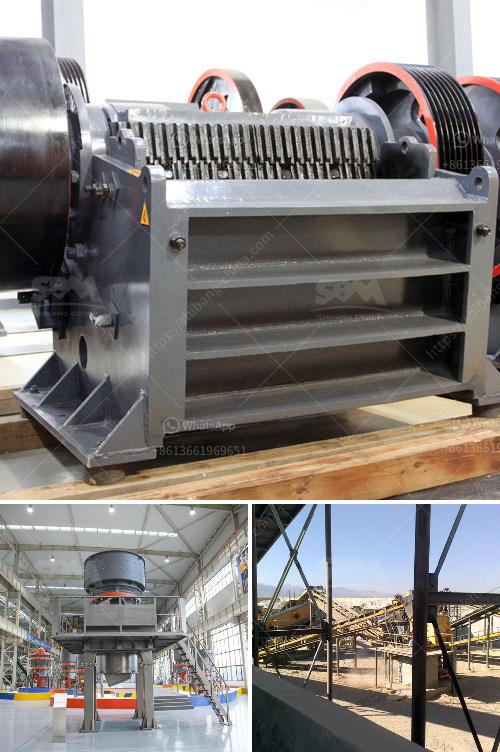

<h3>stone crusher machine price portable</h3>
Stone crusher machine price portable is becoming more and more popular in many industries. With the development of technology, the sales volume of stone crusher machines are increased year by year. Apart from the stone crusher machine price, the customer who want to buy the stone crusher machine should also focus on the quality of the machine, as well as the after-sales service provided by the manufacturer.

Portable stone crusher machine is a new type of crushing equipment that can be quickly transferred as the workplace changes. So it is increasingly popular with customers. The mobile crushing station has a tire type and a crawler type, and the customer can select different models according to the actual site conditions. Moreover, it can be combined into a coarse crushing, medium crushing, and fine crushing three-stage crushing and screening system, or it can be operated independently.

In summary, the portable rock crusher machine is more suitable for construction waste recycling operation, aggregate production project, urban infrastructure construction and road construction, etc. So if you are interested in the stone crusher machine price, portable, please contact us for more information.
<h3>Contact us</h3><ul><li><strong>Whatsapp:&nbsp;<a href="https://wa.me/8613661969651">+8613661969651</a></strong></li><li><a href="https://swt.shibang-china.com/?git&amp;zhl&amp;stone crusher machine price portable"><strong>Online Service(chat now)</strong></a></li></ul><h3>Related</h3><ul><li><a href='belt conveyor indonesia.md'>belt conveyor indonesia</a></li><li><a href='sand screen machine.md'>sand screen machine</a></li><li><a href='limestone crushing project 300 ton per day.md'>limestone crushing project 300 ton per day</a></li><li><a href='rock quarry sizing process.md'>rock quarry sizing process</a></li><li><a href='iron ore 100 150tph belt conveyor price.md'>iron ore 100 150tph belt conveyor price</a></li></ul>