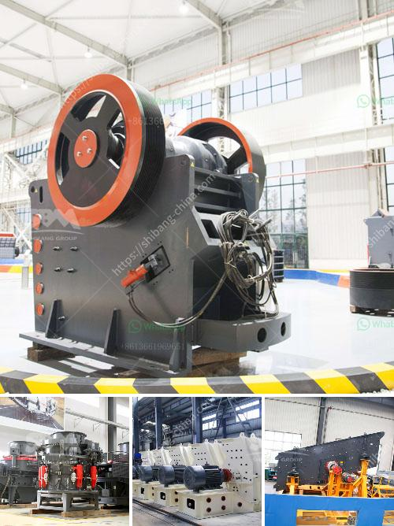

<h3>stone crusher made in italy</h3>
Stone crushing machine can be used to crush rocks into smaller sizes for different purposes. Stone crusher is a machine designed to reduce large rocks into smaller rocks, gravel or rock dust. Crushers may be used to reduce the size or change the form of stones, and waste materials, so it can be easily disposed of or recycled or reduce the size of a solid mix of raw materials, so that pieces of different composition can be differentiated. Crushing is the process of transferring a force amplified by mechanical advantage through a material made of molecules that bond together more strongly, and resist deformation more, than those in the material being crushed do.

In recent years, the market for construction materials has been continuously expanding, which fuels the demand for stone crushers. However, there are still many countries and regions that have insufficient stone resources and need to import a large amount of stone aggregates for construction purposes. Italy is one of the countries that is known worldwide for its impressive stone resources, especially marble. Italy has been known for centuries for its stone quarries, producing a variety of natural stones such as granite, marble, and travertine.

Given this abundance of stone resources, it is no surprise that Italy is a leading manufacturer and supplier of stone crushing machines, with manufacturing plants located in various regions of the country. For instance, in the northern part of Italy, there are many stone crushing machine manufacturers specializing in producing customized machines for the construction industry. These machines include jaw crushers, cone crushers, impact crushers, and various other types.

The Italian stone crushing industry has been in existence for centuries and has been passed down through generations, from father to son. It has seen periods of growth, consolidation, and even decline, but it has always managed to survive and adapt to changing market conditions. Today, Italian stone crushers are still in high demand due to their quality construction and innovative designs. Many Italian companies are at the forefront of stone crusher manufacturing, providing crushing machines that are reliable, durable, and highly efficient.

The stone crushing machines made in Italy are a product of creative engineering and research efforts, which have allowed manufacturers to give new life to what has traditionally been considered a waste material. Italy produces some of the best stone crushing machines in the world, combining technology and manufacturing processes perfected over years of experience.

In conclusion, stone crushing machines manufactured in Italy are a testament to the ingenuity and craftsmanship of Italian artisans and engineers. Through their expertise, these machines have enabled the construction industry to acquire new levels of efficiency and productivity. With Italy's abundance of stone resources, coupled with its expertise in stone crushing machine manufacturing, Italy continues to play a vital role in the global stone crushing industry.
<h3>Contact us</h3><ul><li><strong>Whatsapp:&nbsp;<a href="https://wa.me/8613661969651">+8613661969651</a></strong></li><li><a href="https://swt.shibang-china.com/?git&amp;zhl&amp;stone crusher made in italy"><strong>Online Service(chat now)</strong></a></li></ul><h3>Related</h3><ul><li><a href='bauxite processing plant kenya.md'>bauxite processing plant kenya</a></li><li><a href='horizontal grinding mills price.md'>horizontal grinding mills price</a></li><li><a href='granite and marble business plan pdf.md'>granite and marble business plan pdf</a></li><li><a href='cost estimation for ball mills.md'>cost estimation for ball mills</a></li><li><a href='mobile crusher sale.md'>mobile crusher sale</a></li></ul>