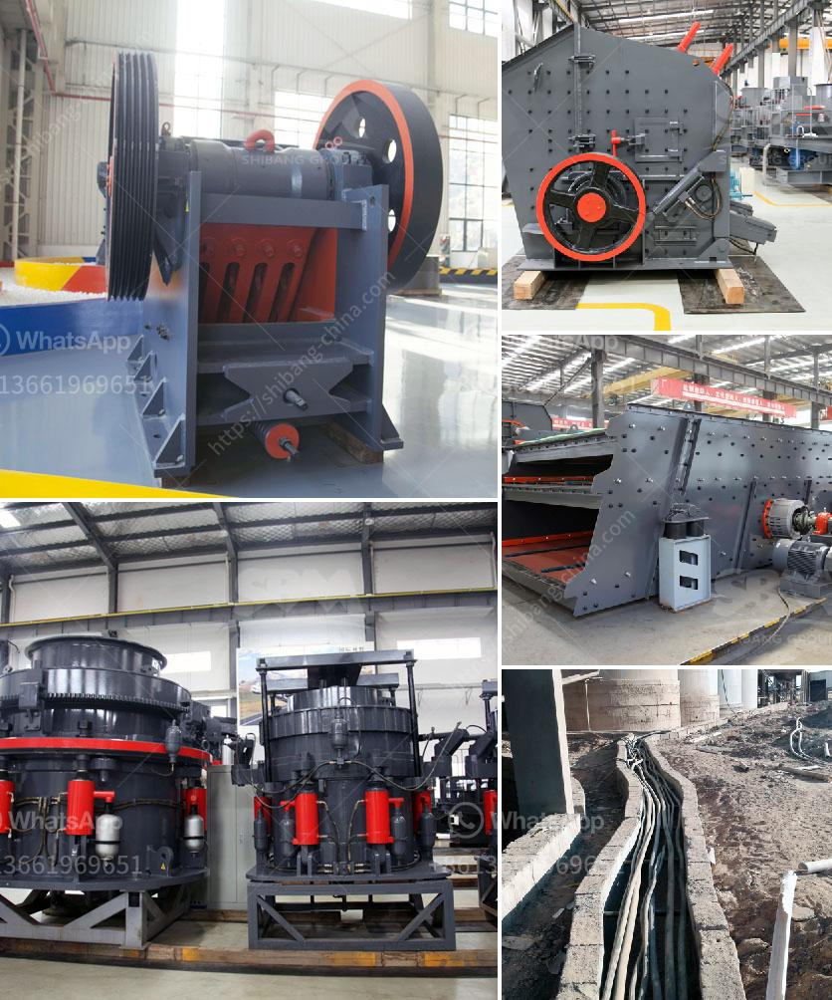

<h3>stone crusher mini</h3>
Stone crusher mini is primarily used for crushing various kinds of stones and lump materials into medium-grained gravel. The materials to be crushed can be hard, medium-hard and soft minerals whose compressive strength should be not more than 320 MPa. This machine uses motor as its power. Through the motor's wheels, the eccentric shaft is driven by the triangle belt and slot wheel to make the movable jaw plate move by a regulated track. Therefore, the materials in the crushing cavity transited by the vibrating feeder bin, hopper evenly into the jaw crusher.

The Stone crusher mini meets different needs of small, medium and large-scale mining operations. Each different type of crusher can also be freely assembled according to customer needs, mainly including jaw tire mobile crushing station, impact tire mobile crushing station, cone tire mobile crusher, impact tire mobile crushing station, heavy hammer type The combination of tire mobile crushing station and crawler mobile crushing station is simple and convenient.

The Stone crusher mini designed by our expert is of high technology, easy to operate, environmentally friendly, and also low cost. The Stone crusher mini can be used in quarries, mines, construction projects, building roads, highways, railway tracks, filling of water bodies, and production of other cement-based products.

Individuals who undertake these medium-sized investments in the Stone crusher mini scheme should have a good understanding of their own funds, local supply and demand changes, procedure for applying for grant programs, and relevant certifications, among other things. Applying for small business start-up loans or individual investment accounts with a good financial institution can definitely help you cosponsor your project. After all, there are quite a few options, so it is best to refer to your accountant and small business adviser.

The Stone crusher mini is equipped with a highly efficient motor that generates the highest power output. The manufacturers have made sure that this product is maintenance-free and comes with extended service life. It has a self-aligning ability, which ensures that the bearings run smoothly even at uneven loads. The innovative design also helps avoid dust pollution and reduces noise emissions.

With its compact design, the Stone crusher mini has a 2" x 2" footprint that can easily fit anywhere in the small-scale stone crushing plant. It is suitable for crushing and reshaping of stones due to its high flexibility and efficiency. There are various different configurations available for the Stone crusher mini to suit the specific needs of every customer.

The Stone crusher mini is the best choice to recycle the construction waste. The newly launched Stone crusher mini can provide customers with the higher crushing capacity and functionality compared to the traditional ones. It provides customers with a low-cost project plan, and the Stone crusher mini is designed with small floor space and low investment cost, so even if there is a temporary power outage, the crushing operation can be carried on.

Overall, the mini crusher is an efficient equipment that helps in breaking stones and other materials into smaller pieces. It facilitates easy disposal of demolished concrete structures, effectively reducing the volume of waste generated. These machines are highly capable of producing aggregates, concrete blocks, asphalt, and other materials for road construction, landscaping, and a variety of other applications. Investing in a mini crusher can prove beneficial for contractors and businesses alike, providing a cost-effective and environmentally friendly solution for stone crushing.
<h3>Contact us</h3><ul><li><strong>Whatsapp:&nbsp;<a href="https://wa.me/8613661969651">+8613661969651</a></strong></li><li><a href="https://swt.shibang-china.com/?git&amp;zhl&amp;stone crusher mini"><strong>Online Service(chat now)</strong></a></li></ul><h3>Related</h3><ul><li><a href='chrome mining business plan crusher.md'>chrome mining business plan crusher</a></li><li><a href='stone crusher machine price in bangladesh.md'>stone crusher machine price in bangladesh</a></li><li><a href='lime stone grinder machine price in india.md'>lime stone grinder machine price in india</a></li><li><a href='bradley grinding mill price.md'>bradley grinding mill price</a></li><li><a href='rock crusher dust fog control system philippines.md'>rock crusher dust fog control system philippines</a></li></ul>