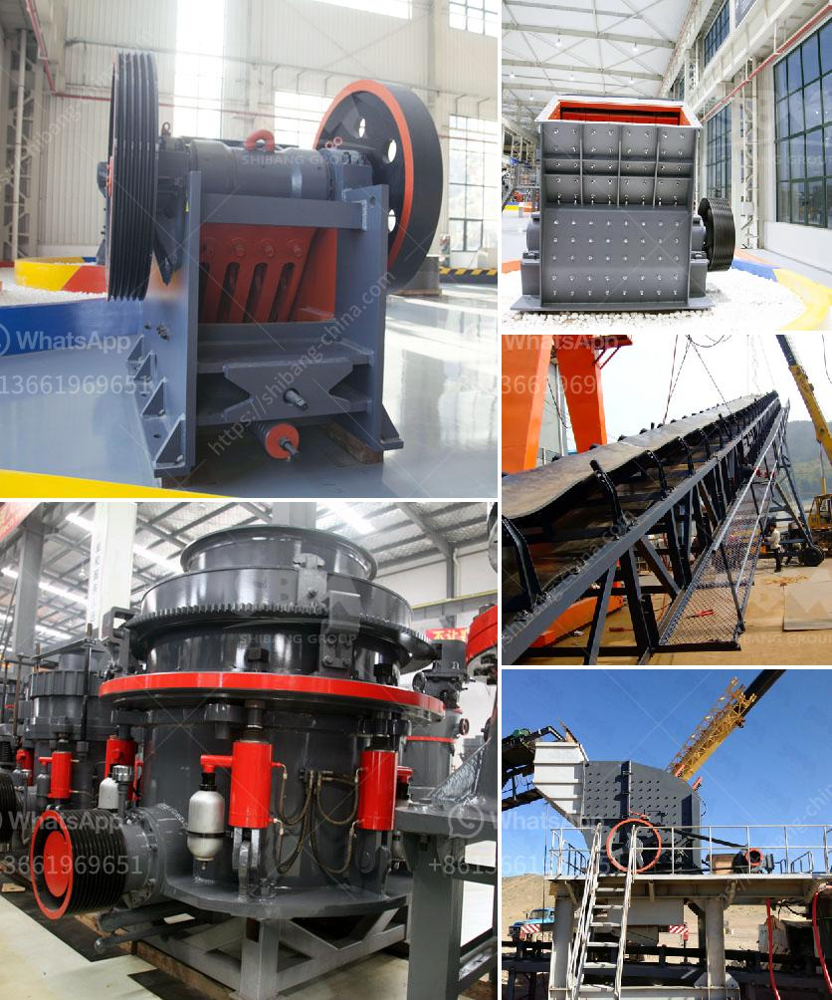

<h3>stone crusher plant capacity 500 600 tph</h3>
Stone crusher plant capacity 500 to 600 tph is one of the most widely used crushing plants in mining industry, for crushing rock, rock, calcite, dolomite, calcium carbonate, coal, limestone, etc. Stone crusher plant's capacity range from 500 to 600 tph refers to the primary crushing equipment, cone crusher and vertical shaft impact crusher, if you need detailed information on equipment selection and configuration, please contact our online customer service for free.

Stone crusher plant capacity 500 to 600 tph has been dedicated in mining industry for several decades. We provide complete series of stone crushing production line with competitive price and reliable quality. We also provide mini stone crusher plant and used stone crusher plant for sale. For any more information, please feel free to contact us.

The 500-600 tph stone crusher plant we offer, covers a wide range of configurations such as primary crushing, jaw crusher, secondary crushing, impact crusher, cone crusher, fine crushing, VSI crusher and sand washing machine. Each crushing process is connected by a conveyor belt, which makes it easier to complete the whole production line.

500-600 tph stone crushing plant is very popular in Arab countries, such as Saudi Arabia, UAE and Oman. With the increasing demands, more and more customers are willing to invest in a stone crushing plant. For stone crushing plants, many different factors need to be taken into consideration, such as production requirements, capital cost, ore characteristic etc.

In conclusion, the stone crusher plant capacity 500 to 600 tph meets the production requirements of large-scale projects. It can be applied to limestone, granite, river stone, iron ore, ferrous ore and other materials. In addition to primary crushing, cone crusher and VSI crusher are usually applied as secondary crushing equipment. To ensure the final product size and shape, jaw crusher, impact crusher and cone crusher should be adopted in shaping stage. For any more details, please feel free to contact us.
<h3>Contact us</h3><ul><li><strong>Whatsapp:&nbsp;<a href="https://wa.me/8613661969651">+8613661969651</a></strong></li><li><a href="https://swt.shibang-china.com/?git&amp;zhl&amp;stone crusher plant capacity 500 600 tph"><strong>Online Service(chat now)</strong></a></li></ul><h3>Related</h3><ul><li><a href='mining equipment price in ghana.md'>mining equipment price in ghana</a></li><li><a href='gypsum crusher plant pdf.md'>gypsum crusher plant pdf</a></li><li><a href='jual ball mill second.md'>jual ball mill second</a></li><li><a href='powder crushing machine making.md'>powder crushing machine making</a></li><li><a href='mobile crushers quarry plant south africa.md'>mobile crushers quarry plant south africa</a></li></ul>