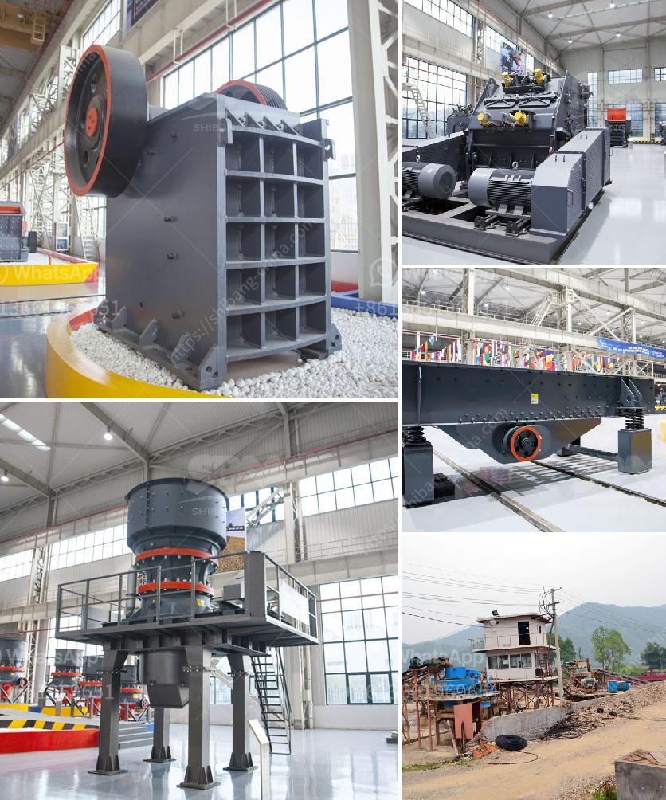

<h3>stone crusher plant indonesia</h3>
Stone crusher plant is a machine designed to reduce the large stone, granites, marble, lime rocks into the smaller size and output gravel, dust, different size of the material.

Stone crusher plants used worldwide. It is available with different-2 capacity, design, and utility. Uses of Crusher plant

Stone crushing industry engaged in producing a crushed stone that used as raw material for various construction activities such as the construction of roads, bridges, buildings, and canals, etc. The stone crushing equipment consists of jaw crusher, impact crusher, cone crusher, fine crusher, roll crusher, hammer crusher, mobile crushing station, etc.

In general, stone crusher plant for sale has stationary type and mobile type. Because of the mobility and flexibility, stone crusher mobile plant becomes more and more popular. Therefore, I will introduce it for you.

Mobile type stone crusher plant can be divided into crawler type plant and tyred type plant. Mobile type stone crushing plant for sale has a compact structure. You can combine with several sets of the mobile plant from a crushing production line, which is convenient to move. Check out the specification of the mobile stone crushing plant for sale to learn it in detail.

As far as choosing a stone crusher for mining work is concerned, there are a number of important things you need to consider to choose the ideal machine for your requirements. For instance, the primary crusher type used in most mining works is a jaw crusher. Jaw crushers are primarily used for crushing big rocks into a size small enough for transportation on conveyor belts. Now, there are three varieties of jaw crushers:

This machine is used for crushing rocks into smaller pieces, usually for gravel or some other road or building application. Most stone crushers have a hopper at the top, a container that holds the rock above the crusher and uses gravity to feed it in. Alternately, rock crushers can use a belt drive to continuously transport the rock into the crusher.

A gyratory crusher consists of a concave surface and a conical head constructed from heavy steel casting. It works by using a gyrating vertical axis to crush rocks into small particles. This type of crusher is used when the size of the rocks requires being minimized. However, gyratory crushers can be utilized for primary or secondary crushing as they function under the same principle.

As the name suggests, a cone crusher is used to crush rocks into progressively smaller pieces. It works by squeezing the rock between an eccentrically gyrating spindle. These machines are equipped with a hydraulic control system that allows for simple and easy configuration settings, as well as safe clearing of any blockages.

Stone crusher plant is used for producing various sizes of crushed stones which are used as raw material for various construction activities. These crushers use impact, jaw, cone, hammer, and roller crushers to crush different materials that are used in different industry sectors. The crushing process is carried out by throwing the material fed into the machine to strick against a particular surface or by compression-breaking with the overhead eccentric force. Whether it is a stationary or mobile crushing plant, each type of crusher is different and can meet your requirements based on the nature of the stone being handled.
<h3>Contact us</h3><ul><li><strong>Whatsapp:&nbsp;<a href="https://wa.me/8613661969651">+8613661969651</a></strong></li><li><a href="https://swt.shibang-china.com/?git&amp;zhl&amp;stone crusher plant indonesia"><strong>Online Service(chat now)</strong></a></li></ul><h3>Related</h3><ul><li><a href='changchai ballast crusher.md'>changchai ballast crusher</a></li><li><a href='trommel ball mill.md'>trommel ball mill</a></li><li><a href='raymond grinding mill europe.md'>raymond grinding mill europe</a></li><li><a href='how much investment needed to start a crusher in canada.md'>how much investment needed to start a crusher in canada</a></li><li><a href='hammer mill 25 ton hour.md'>hammer mill 25 ton hour</a></li></ul>