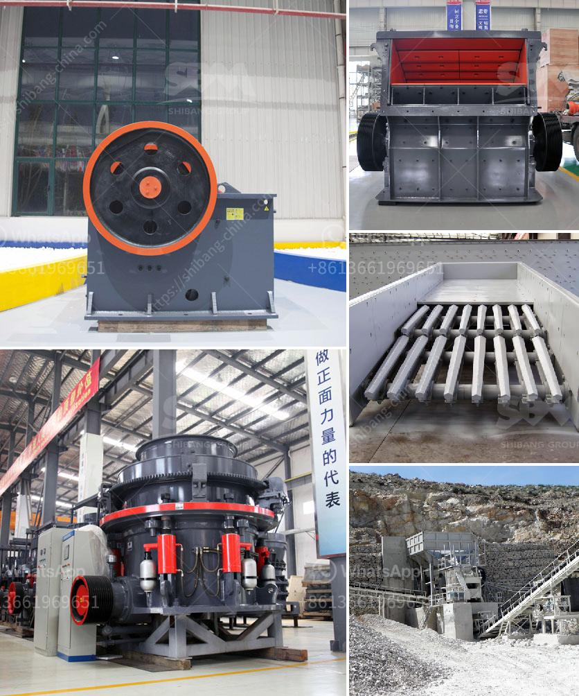

<h3>stone crusher plant machinery</h3>
Stone crusher plant machinery depends on the feed size of the stone, the desired product size and the size of the crusher used. Following are the generally required machinery:

The main machinery involved in the stone crushing industry is hammer crusher, screen, conveyors, etc. The process involved is to feed the stone into the hammer crushers to make it further smaller in size as required by the customer. In the hammer crusher, the stone is crushed. The crushed stone is screened to separate the produce in different sizes by the separator.

The crushed stone is conveyed to the vibrating screen where it is sorted into different sizes. The smaller size stone is sent to the material pile by the conveyor belt, while the sizes larger than the required ones will be sent to the crusher for further crushing until they reach the desired size.

Stone crusher plant machinery relies on the ability of the jaw crusher to crush the hard rock ore and other materials. This is why jaw crushers are widely used in the primary rock crushing stage. You can put this kind of crusher in the first stage of crushing because it can reach the maximum feeding size of 125-1200 mm and crush the material down to 10-350 mm. Meanwhile, jaw crushers have a wide application as they can crush various kinds of materials due to their simple structure and easy maintenance.

The cone crusher is also known as the secondary crusher because it is often used after the primary crusher. The purpose of the cone crusher is to break the larger ore into smaller particles so as to facilitate the subsequent transportation and grinding operation of the ore. Cone crushers have a large crushing ratio, high efficiency, low energy consumption, uniform product particle size, and are suitable for crushing and finely breaking various ores and rocks.

The vibrating screen is the screening equipment used after the primary and secondary crushing process. It is used to separate the crushed stones into different sizes. The high-quality vibrating screen can separate the final product grades, making them suitable for different uses. When choosing the vibrating screen, you should consider the type of material, abrasiveness, screening requirements, and the size and shape of the particles. In general, the vibrating screen has various types of screening layers, such as single-layer, double-layer, triple-layer, and four-layer vibrating screens, which can meet different needs.

In conclusion, stone crusher plant machinery is a vital equipment in stone crushing industry. It effectively solves the problem of high operation rate and maintenance cost of the existing crushing equipment. Customers can benefit from its high reliability and low operating cost. It is suitable for various materials, such as granite, marble, limestone, quartz stone, basalt, river pebbles, iron ore, copper ore, etc. It has a wide application range and is favored by users. High-quality stone crusher machinery can provide a competitive edge in stone crushing industry.
<h3>Contact us</h3><ul><li><strong>Whatsapp:&nbsp;<a href="https://wa.me/8613661969651">+8613661969651</a></strong></li><li><a href="https://swt.shibang-china.com/?git&amp;zhl&amp;stone crusher plant machinery"><strong>Online Service(chat now)</strong></a></li></ul><h3>Related</h3><ul><li><a href='tata stone crusher machines.md'>tata stone crusher machines</a></li><li><a href='25 used crushing machine price.md'>25 used crushing machine price</a></li><li><a href='dolomite ball mill price.md'>dolomite ball mill price</a></li><li><a href='marble crusher machine.md'>marble crusher machine</a></li><li><a href='crusher machine for hardened powder.md'>crusher machine for hardened powder</a></li></ul>