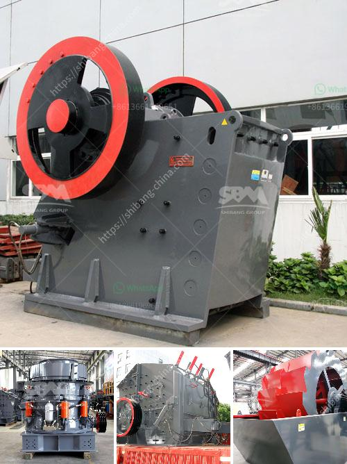

<h3>stone crusher plant manufacturers</h3>
Stone crusher plant manufacturers have become more and more prolific in the market as the demand for stones has increased significantly. Industry players such as quarries, stone crushing plants, cement factories, and other related industries are getting established, and many have started to provide their services abroad. This growth has led to an increase in the competition level amongst manufacturers, resulting in the production of high-quality stone crusher plants.

A stone crusher plant is a powerful machine designed to break the stone or rock into small, manageable pieces. Crushers are more commonly used for this purpose. There are various types of crushers available in the market, including compression crushers and impact crushers.

As the name suggests, compression crushers compress the stones until they break. This type of crusher is suitable for materials like limestone, granite, and concrete. On the other hand, impact crushers utilize a more significant force by creating a strong impact against the stones. They are ideal for materials with lower abrasiveness, such as salt, coal, or gypsum.

When it comes to stone crusher plant manufacturers, the industry can be broadly categorized into online and offline crushing plants. While offline plants are popular and well-established, online plants are gaining popularity due to their flexibility, lower cost of operation, and convenience. Online stone crusher plant manufacturers provide their services through online platforms, making it easier for customers to connect and get quotes for their projects.

One of the advantages of online stone crusher plant manufacturers is that they offer a wide range of designs and configurations to meet the specific needs of their customers. These manufacturers understand that not all customers have identical requirements, and therefore, they provide customizable options. This flexibility allows customers to choose the most suitable plant design that meets their production targets and budget.

Moreover, online stone crusher plant manufacturers ensure that their machines are of high quality and meet the required standards. They use modern technology and advanced materials to manufacture these plants, resulting in durable and reliable machines. The use of high-quality components also minimizes downtime and maintenance costs, ensuring maximum productivity for the customer.

In addition to manufacturing high-quality stone crusher plants, these manufacturers offer comprehensive after-sales services. They provide installation and commissioning support, along with training for the operation and maintenance of the plant. This support ensures that the customers can smoothly start their operations and get the maximum benefit from the plant.

To conclude, stone crusher plant manufacturers play a crucial role in the construction industry. They provide the necessary equipment to break the stones into smaller pieces, meeting the demand for stones in various construction projects. With the advent of online stone crusher plant manufacturers, customers have access to a wide range of designs and configurations, along with excellent after-sales services. It is important to choose a reliable and reputable manufacturer to ensure the quality of the machine and maximize the return on investment.
<h3>Contact us</h3><ul><li><strong>Whatsapp:&nbsp;<a href="https://wa.me/8613661969651">+8613661969651</a></strong></li><li><a href="https://swt.shibang-china.com/?git&amp;zhl&amp;stone crusher plant manufacturers"><strong>Online Service(chat now)</strong></a></li></ul><h3>Related</h3><ul><li><a href='usa used equipment grinding mill 100tph 200 mesh.md'>usa used equipment grinding mill 100tph 200 mesh</a></li><li><a href='chrome mining business plan.md'>chrome mining business plan</a></li><li><a href='coal washing plant for sale.md'>coal washing plant for sale</a></li><li><a href='iron ore crushed second hand machines.md'>iron ore crushed second hand machines</a></li><li><a href='limestone crushing project 300 ton per day.md'>limestone crushing project 300 ton per day</a></li></ul>