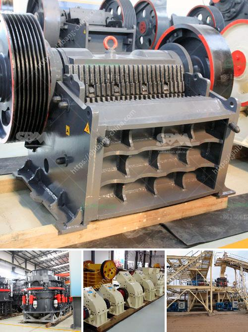

<h3>stone crusher plant price in india</h3>
With the increasing traffic in city infrastructure construction, there is a rising demand for the cement, concrete and other construction materials. Stone crusher plant is one of the most commonly used building materials equipment. They are used to transform large stone into smaller stone products like gravels and sand. Those machines are typically used on building sites, quarries and in the recycling industry.

Stone crusher plants are available in two major types namely (a) stationary (b) portable or mobile. However, you can establish stationary crushers at quarry heads. Mainly, at the construction site, you can use the portable crushers. Here we have explained the stationary stone crusher plant details.

Stone boulders are the only raw material required for the stone crusher plant. Related: 10 Self Rewarding Social Enterprise Business Ideas. Stone Crusher Plant Production Process. First of all, break the big stone boulders to smaller size manually. Then it is fed to the stone crusher. The crusher can accept the stone size of 175mm. Stone crushing is the two-stage process. In the first stage, crush the 175mm stone to about 50mm. Thereafter, fit the crusher with a conversion kit to enable granulation of 5 to 20mm. Then screen the crushed material by the rotary screen. Unit location is a major factor for stone crusher plant business.

Also, the availability of raw material is important. The availability of raw material is presumed to have little influence as such. The main machinery involved in the stone crushing industry is hammer crusher, jaw crusher, impact crusher, cone crusher, screen, conveyers, etc.

The process involved is to feed the stone in to the hammer crushers to make it further smaller in size as required by the customer. In the hammer crusher, the stone is crushed. The crushed stone is screened to separate the produce in different sizes by the separator. The crushed stone is conveyed by the conveyors to trucks for transport to the market place or storage area.

As a professional stone crusher plant equipment manufacturer, Fote Heavy Machinery insists on providing customers with high yield, energy-saving and environmental equipment to help them gain a foothold in the competitive market. With the increasing demand for sand and gravel aggregate, the unique design of the stone crusher, the competitive price, and excellent performance have been welcomed by customers.

The stone crushing plant is mainly composed of vibrating feeder, jaw crusher, impact crusher, vibrating screen, belt conveyor, centralized electric control and other equipment. The designed output is generally 50-800t/h, in order to meet the different processing needs of customers. It can be equipped with a cone crusher, dust removal equipment, etc. Stone crushing plant has reliable performance, reasonable design, convenient operation, high work efficiency and granularity of the final products.

Stone crusher plant prices are different according to crusher types and production capacity. Stone Crushing Operation India is abundant with stone resources that include granite, marble, sandstone, limestone, slate, and quartzite etc. Stone crushing industry has long history and plays important role in economy development in India.
<h3>Contact us</h3><ul><li><strong>Whatsapp:&nbsp;<a href="https://wa.me/8613661969651">+8613661969651</a></strong></li><li><a href="https://swt.shibang-china.com/?git&amp;zhl&amp;stone crusher plant price in india"><strong>Online Service(chat now)</strong></a></li></ul><h3>Related</h3><ul><li><a href='crusher plant price in ethiopia.md'>crusher plant price in ethiopia</a></li><li><a href='marble and granite plant.md'>marble and granite plant</a></li><li><a href='handmade rock crusher.md'>handmade rock crusher</a></li><li><a href='south africa crusher sale.md'>south africa crusher sale</a></li><li><a href='ball mill 5kg capacity price.md'>ball mill 5kg capacity price</a></li></ul>