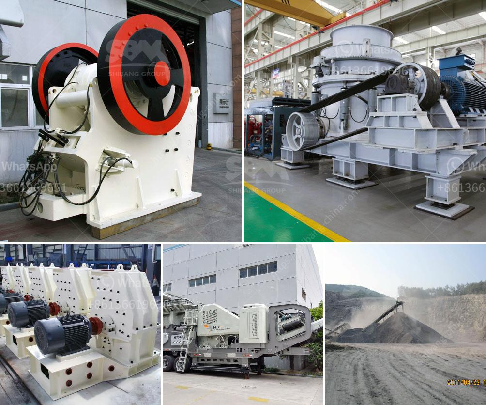

<h3>stone crusher plants peru</h3>
Mining is an industry that has been essential for the development of societies worldwide. As the demand for minerals and resources increases, mining operations have expanded, meeting this raging demand. However, it is essential to ensure that these operations are sustainable and have minimal negative impact on the environment. Peru, known for its rich natural resources, has taken significant steps towards sustainable mining by promoting the use of stone crusher plants to manufacture aggregate materials that are vital for the construction industry.

Stone crusher plants are machines designed to process the raw rocks into aggregates of desired size. With the development of infrastructure projects and urbanization around the world, the demand for stone aggregates is increasing. It is estimated that 1.6 billion tons of aggregates are produced annually worldwide, making stone crushing a significant industry.

Peru, a country known for its diverse ecosystems and rich biodiversity, has seen considerable growth in the mining sector over the years. To minimize the environmental impact of mining operations, the government has implemented various regulations and promoted sustainable practices. One of these initiatives is the use of stone crusher plants in quarrying activities to produce aggregates.

The process of stone crushing involves several stages. First, the raw material is extracted from the quarry and conveyed to the crusher. The crushing plant usually consists of primary and secondary crushers equipped with screens, conveyors, and magnets to remove foreign materials. The crushed stones are then screened into different sizes according to the customers' requirements. The final product, known as aggregates, is used for various applications such as in concrete production, road construction, and railway ballast.

Stone crusher plants have several advantages over traditional crushers, such as low energy consumption, easy installation and maintenance, and a high production capacity. Moreover, the use of stone crusher plants in Peru promotes employment opportunities for local communities, as it requires a considerable workforce to operate the plants and handle the transportation of aggregates. This, in turn, helps to boost the economy and create a sustainable livelihood for the locals.

Additionally, stone crusher plants in Peru contribute to reducing the country's dependence on imported aggregates. By producing aggregates domestically, Peru can save costs associated with transport and foreign currency exchange. Furthermore, the availability of locally sourced aggregates enables faster and more efficient construction projects, meeting the demands of the growing urban population.

However, it is crucial to address the potential environmental concerns associated with stone crusher plants. Mining activities, including stone crushing, can have negative impacts on the environment if not managed properly. To mitigate these effects, the government of Peru has implemented strict regulations and encourages mining companies to adopt sustainable practices. It is necessary to monitor and control dust emissions, manage waste generated from the crushing process, and properly reclaim the quarries after extraction.

In conclusion, the use of stone crusher plants in Peru offers numerous benefits for sustainable mining operations. It helps fulfill the increasing demand for aggregates, promotes employment, strengthens the local economy, and reduces dependence on imports. However, it is essential to implement and adhere to environmental regulations to ensure that stone crushing activities are carried out responsibly, safeguarding the environment and the communities involved. By embracing sustainable solutions, Peru sets a positive example for other countries to follow in their pursuit of a greener future.
<h3>Contact us</h3><ul><li><strong>Whatsapp:&nbsp;<a href="https://wa.me/8613661969651">+8613661969651</a></strong></li><li><a href="https://swt.shibang-china.com/?git&amp;zhl&amp;stone crusher plants peru"><strong>Online Service(chat now)</strong></a></li></ul><h3>Related</h3><ul><li><a href='working principle of conveyor belt.md'>working principle of conveyor belt</a></li><li><a href='crushing plants suppliers sales in nigeria.md'>crushing plants suppliers sales in nigeria</a></li><li><a href='stone crushing machines in oman.md'>stone crushing machines in oman</a></li><li><a href='cost estimation for ball mills.md'>cost estimation for ball mills</a></li><li><a href='cost on vsi crusher.md'>cost on vsi crusher</a></li></ul>