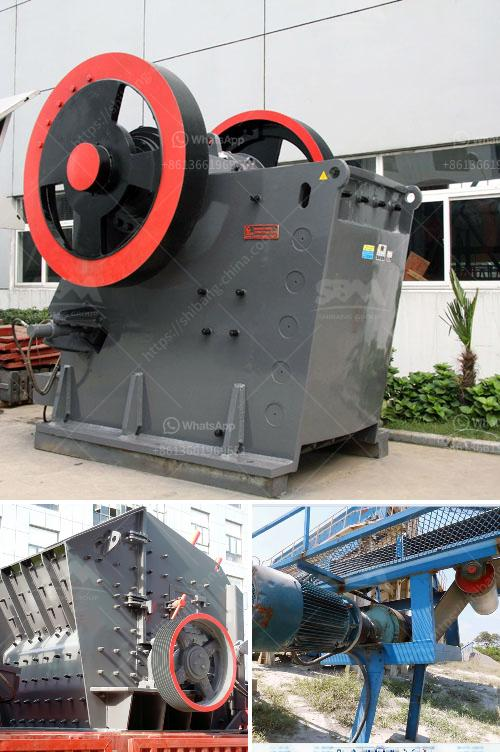

<h3>stone crusher price in dubai</h3>
Stone crushing machine has a wide range of applications in various industries, such as mining, construction, metallurgy, chemistry, and highways, etc. Dubai is a huge market for such machines and therefore, there are numerous suppliers of stone crushing machines in Dubai. However, crushing equipment that is inexpensive may not be reliable and of good quality, and buying such equipment can waste your money.

When looking for stone crushing machines in Dubai, make sure to check out the different suppliers available. While there may be many suppliers, it is important to choose a reliable and reputable supplier who offers machines of good quality at competitive prices.

One of the factors that determine the stone crusher machine price in Dubai is the capacity of the machine. Higher capacity machines have higher prices, as they can handle more rocks and materials efficiently. Other factors that affect the price include the brand, model, and material used in the construction of the machine.

Additionally, different suppliers may have different pricing strategies. Some suppliers may offer discounts or promotional prices, which can be beneficial for customers looking for affordable options. Therefore, it is important to compare prices and offerings from different suppliers to get the best value for your money.

Moreover, it is also crucial to consider the after-sales service provided by the supplier. A reliable supplier should offer technical support, training, and maintenance services to ensure that the machine operates at its optimum capacity and longevity.

In conclusion, when looking for stone crushing machines in Dubai, it is important to choose a reliable and reputable supplier who offers machines of good quality at competitive prices. Comparing prices and offerings from different suppliers is advisable to get the best value for your money. Remember to also consider the after-sales service provided by the supplier to ensure the machine operates efficiently in the long run.
<h3>Contact us</h3><ul><li><strong>Whatsapp:&nbsp;<a href="https://wa.me/8613661969651">+8613661969651</a></strong></li><li><a href="https://swt.shibang-china.com/?git&amp;zhl&amp;stone crusher price in dubai"><strong>Online Service(chat now)</strong></a></li></ul><h3>Related</h3><ul><li><a href='vertically roller mill pakistan.md'>vertically roller mill pakistan</a></li><li><a href='stamp mill for sale in south africa.md'>stamp mill for sale in south africa</a></li><li><a href='limestone ball rod mill.md'>limestone ball rod mill</a></li><li><a href='roll crusher kenya.md'>roll crusher kenya</a></li><li><a href='ton per jam jaw crusher.md'>ton per jam jaw crusher</a></li></ul>