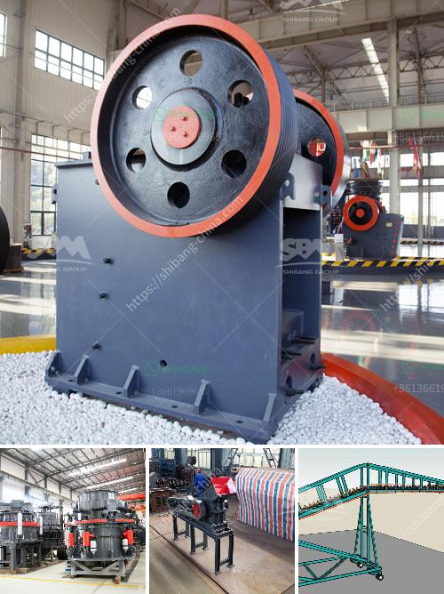

<h3>stone crusher pricetonnes capacity per hour</h3>
Stone crusher is essential equipment in mining machinery, common stone crusher mainly include jaw crusher, mobile crushing station, counter-attack crusher, impact crusher, compound crusher, roller crusher, etc. It can be useful for primary, secondary and fine crushing of stones and cone crusher is often used for crushing medium and high hardness materials. In order to meet the market demand, our company independently developed a mobile crushing plant, which can move to the source of stones with high efficiency, flexibility and low costs, and compose a complicated application. 

The stone crusher market in the world has grown at a steady pace in these years. The average selling price of the stone crusher machine in China this year will be lower about 8.2% than the last year for the fierce competition. Several factors will effect the price of stone crusher machine below. 

1. The price of stone crusher depends on the quality , different quality with different price. So when they making design or manufacture the products, all factors will be considered by the manufacturers.

2. Brand effect: There are many brands of stone crusher, such as whyte, Telsmith, Nordberg, Fruehauf, etc. The brand is the most important factor affecting the price. Different brands of stone crusher have different prices.

3. The price of stone crusher is affected by the inflation fluctuation and national policies. Whether it is a mobile or fixed crusher, there is a high fixed cost of investment in equipment, workers, logistics, transportation, and other processes, which inevitably leads to a high overall cost. So how can the price of stone crusher be low?

4. The price of large-scale stone crusher should be lower than that of the small-scale stone crusher, because the specific matching of crushing equipment is decided by the specifications of the equipment. So when purchasing the crushing machine, equipment with lower price should be the best choice for investors.

5. The price of 300-500t/h stone crusher requires different types of stone crusher, equipment configuration is different, and the production requirements are also different.

6. The price of 300-500t/h stone crusher is different, because the different types of equipment manufactured by the same manufacturer have different specifications and different output. In addition, the size of the production capacity, total quantity, and the range of the cost of input materials also have a great impact on the price.

So, how much does a stone crusher machine cost? From the above analysis, we can clearly know that the stone crusher machine can work under different crushing conditions. It can be used to crush hard materials, soft materials, and the fine crushing work is also very good. When we purchase the stone crusher machine, we need to consider the production needs. According to our production needs, we can choose the appropriate type of crushing equipment. The price of the stone crusher machine will depend on the model and the production capacity. You can choose the appropriate specifications and types according to your need, and the price will depend on your needs.

In conclusion, there are many factors affecting the price of stone crusher, such as specific crusher type, specific crusher model, and specific production requirements. Stone crusher has become a popular investment element with high efficiency, low cost, stable operation and high quality. The stone crushers produced by our company are your best choice. So if you are interested in our stone crusher, please contact us.
<h3>Contact us</h3><ul><li><strong>Whatsapp:&nbsp;<a href="https://wa.me/8613661969651">+8613661969651</a></strong></li><li><a href="https://swt.shibang-china.com/?git&amp;zhl&amp;stone crusher pricetonnes capacity per hour"><strong>Online Service(chat now)</strong></a></li></ul><h3>Related</h3><ul><li><a href='quartz manufacturing process from mineral.md'>quartz manufacturing process from mineral</a></li><li><a href='cement factories for sale in pakistan.md'>cement factories for sale in pakistan</a></li><li><a href='limestone production mining equipment for sale.md'>limestone production mining equipment for sale</a></li><li><a href='concrete crusher machine for sale.md'>concrete crusher machine for sale</a></li><li><a href='fintec mobile screens for sale australia.md'>fintec mobile screens for sale australia</a></li></ul>