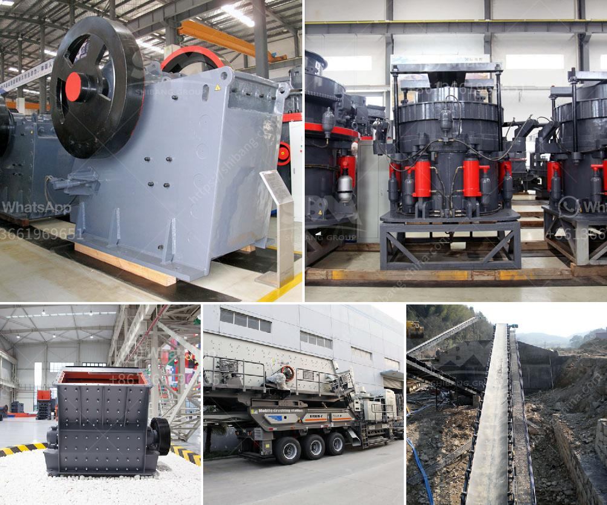

<h3>stone crusher to buy in bangalore</h3>
Stone crusher machines are widely used in mining industry. There are various types of crusher machines in the market, such as jaw crusher, counterattack crusher, vertical impact crusher, hydraulic cone crusher, hammer crusher, roll crusher, compound crusher, cone crusher, the two-stage crusher, gyratory crusher, mobile crusher and so on. In order to choose a suitable stone crusher machine, customers should conduct a comprehensive survey and research and select reliable stone crusher manufacturer and supplier.

Stone crusher machines are used for crushing stones or rocks into smaller particles for construction purposes. These machines can deliver crushed rocks of various sizes as per the requirement of the construction industry. Some of the popular sizes that these crushers can produce include 1-2 inch, 2-4 inch, and 9-12 inch stones. Stone crushers typically feature a large crushing ratio and high crushing efficiency, which can be used for primary or secondary crushing depending on the application.

Considering the weight and volume of the machine, a suitable transportation plan should be prepared in advance. The specific delivery time needs to be determined after contacting the stone crusher manufacturer and supplier. Some manufacturers offer free transportation, while others may charge for it. It's important to compare the prices, services, and delivery options offered by different manufacturers before making a purchase.

When buying a stone crusher machine, it's important to understand the specifications of the machine, capacity, power, and other factors. The size of the feeding material determines the type of crusher machine required. For example, larger materials need to be processed by a primary crusher machine, while smaller materials will be reduced by a secondary and tertiary crusher machine.

In conclusion, customers looking to buy stone crusher machines in Bangalore should consider multiple factors like quality, reputation, and after-sales service of the manufacturer or supplier. To ensure their investment is worth it, they should conduct thorough research and comparison before making a decision.
<h3>Contact us</h3><ul><li><strong>Whatsapp:&nbsp;<a href="https://wa.me/8613661969651">+8613661969651</a></strong></li><li><a href="https://swt.shibang-china.com/?git&amp;zhl&amp;stone crusher to buy in bangalore"><strong>Online Service(chat now)</strong></a></li></ul><h3>Related</h3><ul><li><a href='crusher machine for hardened powder.md'>crusher machine for hardened powder</a></li><li><a href='jaw crusher what price in china.md'>jaw crusher what price in china</a></li><li><a href='used stone crusher for sale in florida.md'>used stone crusher for sale in florida</a></li><li><a href='quartz ball milling machinery.md'>quartz ball milling machinery</a></li><li><a href='hammer mill grinder thailand.md'>hammer mill grinder thailand</a></li></ul>