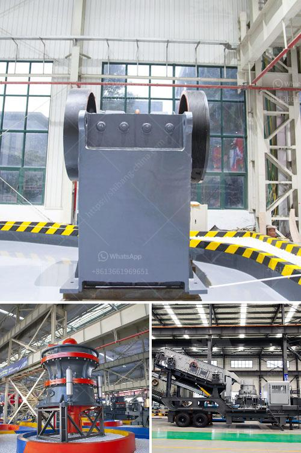

<h3>stone crusher unit project report</h3>
Stone crushing unit is an important industrial sector in the country engaged in producing crushed stone of various sizes depending upon the requirement which acts as raw material for various construction activities such as construction of roads, highways, bridges, buildings, and canals etc. It is estimated that there are over 12,000 stone crusher units in India. The number is expected to grow further keeping in view the future plans for development of infrastructure of roads, canals, and buildings.

Crushed stone is segregated into various sizes like 35mm, 20mm, 12mm etc for different uses. Crushed stone aggregates are used for construction of roads, bridges, housing, industril building construction and other cement based products like RCC pipes, PSC poles, premoulded slabs, frames and beems etc for fabrication. It is advantageous if the crushed stone unit is set up near the quarries where the granite boulders of various sizes are available for the crushing unit. The wastage from the granite industry will be of much use ot the crushed stone unit.

The unit will be set up with 10,000 sq.mt. of land lease. The total project cost is estimated at Rs. 25.00 Lacs. The unit has already got provisional registration with DIC. Prior to coming into operation, the project will be scrutinized by the Pollution Control Board. The electrical loadings, connecting machinery, pipe line, and installation should be checked prior to bringing the plant into operation. All electrical  details and specifications must be obtained from the respective authorities.

The main machinery involved in the stoone crushing plant is jaw crusher, cone crusher, screen, conveyers etc. The process involved is to feed the stone in to the jaw crushers to make it further smaller in size as required by the customer. In the hammer crusher, the stone is crushed. The crushed stone is screened to separate the produce in different sizes by the separator. The crushed stone is conveyed by the conveyors to trucks for transport to the market place or storage area./

Stone crusher unit project report is available in a variety of formats. Report serves as a guide from which the client can derive business, investment, or strategic planning. Project Report provides key statistics on the market status of the Stone Crusher Unit manufacturers and is a valuable source of guidance and direction for companies and individuals interested. The Project Report provides a basic overview of the industry including its definition, applications, and manufacturing technology. The report also states the industry's market share, growth prospects, and challenges for the forecast period. 

All in all, the Stone Crusher Unit Project Report provides valuable information for the interested parties to navigate the stone crushing market with ease.
<h3>Contact us</h3><ul><li><strong>Whatsapp:&nbsp;<a href="https://wa.me/8613661969651">+8613661969651</a></strong></li><li><a href="https://swt.shibang-china.com/?git&amp;zhl&amp;stone crusher unit project report"><strong>Online Service(chat now)</strong></a></li></ul><h3>Related</h3><ul><li><a href='project report on stone crushing unit.md'>project report on stone crushing unit</a></li><li><a href='stone crusher pricetonnes capacity per hour.md'>stone crusher pricetonnes capacity per hour</a></li><li><a href='design calculations of rotary dryer.md'>design calculations of rotary dryer</a></li><li><a href='second hand concrete grinding machine supplier in dubai.md'>second hand concrete grinding machine supplier in dubai</a></li><li><a href='mtm grinding mill.md'>mtm grinding mill</a></li></ul>