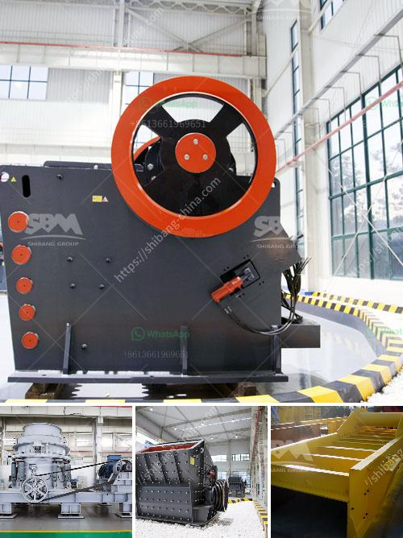

<h3>stone crushers for sale in south korea</h3>
Stone crushers are essential crushing equipment in mining and stone quarry site. In stone quarry, stone crushers are used to crush stones into small particle size or change the form such as basalt, granite, limestone, quartz, marble, for building aggregates, artificial sand production and recycle building waste materials such as debris, asphaltic cement concrete. Usually in stone crushing plant, Jaw crusher is used as primary crusher machine, when big stones are crushed smaller by Jaw crusher; they are transferred to Impact crusher or Cone crusher for secondary or tertiary crushing, then go through the stone shaping machine for getting cubic size.

Stone crushers in South Korea are increasingly demanding machines for structural refinement and materials quality requirements. SBM, a predominate supplier of high-quality stone crushers, is located in Zhengzhou, China since 1997. With ISO9001:2008 Quality Management System certification and nearly 20 years of experience in the business, we are confident that SBM can provide you with superb stone crushing equipment and complete processing plants.

Our jaw crushers have been used as crushing power for clients over 30 countries in Africa (Algeria, Egypt, Malawi, South Africa, Chad, Nigeria, etc,.) Middle East (Saudi Arabia, Jordan, Yemen, Iraq, Iran, etc,.) Asia (Korea, Burma, Vietnam, Indonesia, Malaysia, India, Philippines, Pakistan, Iran, Russia, Kazakhstan, Uzbekistan, etc,.) Australia (Mexico, Chile), and North America (Canada, Panama, Bolivia, Colombia, etc,.) markets. Thanks to the trust of our worldwide customers, we have gained a global sales network. We offer a wide range of stone crushers, including jaw crushers, impact crushers, cone crushers, hammer crushers, vertical shaft impact crushers, sand making machines, belt conveyors, vibrating feeders, vibrating screens and so on. All our products meet international standards and are designed and manufactured to meet specific customer requirements.

South Korea is a country with a lot of mineral resources and can meet various needs. The demand for stone crusher will continue to grow with the growth of its user industry. The manufacturers are also providing machinery and equipment with new technology and guarantee to ensure the new process and technology in the waste separation and recycling industry to provide efficient equipment for construction waste and ore processing.

Stone crushers for sale in South Korea are also available on various online portals. These online platforms provide a wide range of options to buyers from various parts of the world to choose from. Depending on the purpose of their use, the machines can be acquired in variety of sizes, shapes, and specifications. Whether you are looking for stone crushers for sale or other crushers for sale, Shunky Machinery is the most reliable, best-performing, and robust stone crushers manufacturer in China.

In conclusion, it is important to note that stone crushers are an important part of South Korea's construction industry and are key players in the crushing and screening industry. As a result, stone crushers for sale in South Korea have grown significantly in recent years with more developments in the infrastructure and mining industries. With a wide range of stone crushers on the market, buyers should ensure they choose a stone crusher that meets their desired specifications and requirements to get optimal results.
<h3>Contact us</h3><ul><li><strong>Whatsapp:&nbsp;<a href="https://wa.me/8613661969651">+8613661969651</a></strong></li><li><a href="https://swt.shibang-china.com/?git&amp;zhl&amp;stone crushers for sale in south korea"><strong>Online Service(chat now)</strong></a></li></ul><h3>Related</h3><ul><li><a href='belt conveyor continental di indonesia.md'>belt conveyor continental di indonesia</a></li><li><a href='open cast mining equipment for sale south africa.md'>open cast mining equipment for sale south africa</a></li><li><a href='gypsum powder production equipment price.md'>gypsum powder production equipment price</a></li><li><a href='business plan on how to start a small scale quarry plant.md'>business plan on how to start a small scale quarry plant</a></li><li><a href='milling machine grinding mill.md'>milling machine grinding mill</a></li></ul>