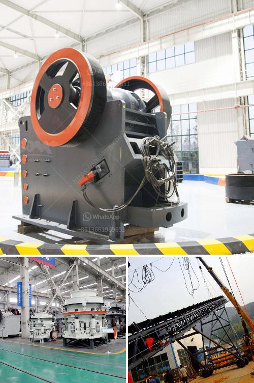

<h3>stone crushers for sale usa</h3>
Stone crushers are a fundamental part of the mining process, used for breaking down large rocks into smaller sizes for further processing. Whether you need a used rock crusher for sale, a concrete crusher, or something for iron ore, sandstone, and other similar materials, the expert sellers at My Little Salesman have got you covered.

Choosing the right portable rock crusher or crusher plant is crucial for every construction or mining project. While portable crushers are easy to transport and move at a later date, they are also costly and require more maintenance compared to stationary crushers. This is why a stationary crusher may be the best option for certain projects.

Depending on the mine project, these crushing plants can be classified into three main types: jaw crusher, impact crusher, and cone crusher. However, since each plant is unique, the types of crushers selected will depend on factors like the size and hardness of the material being processed as well as the desired output size.

When it comes to finding high-quality stone crushers for sale in the USA, it is important to consider different options, such as used crushers from reputable manufacturers. These reliable machines offer numerous benefits, including reduced upfront costs, durability, and the ability to deliver consistent output.

Furthermore, used stone crushers often come with a warranty, ensuring that they are always in good condition. This allows buyers to have peace of mind knowing that their purchase is protected against any potential defects or malfunctions.

The availability of used stone crushers also means that contractors and construction companies can have access to high-quality machinery without breaking the bank. This can be particularly beneficial for smaller businesses or those on a tight budget.

In conclusion, stone crushers for sale in the USA are essential for various industrial sectors, from mining to construction. Choosing the right crusher for your operations and buying used can help ensure that you get the best value for your investment. With a wide range of options available, it is easier than ever to find the perfect stone crusher for your needs.
<h3>Contact us</h3><ul><li><strong>Whatsapp:&nbsp;<a href="https://wa.me/8613661969651">+8613661969651</a></strong></li><li><a href="https://swt.shibang-china.com/?git&amp;zhl&amp;stone crushers for sale usa"><strong>Online Service(chat now)</strong></a></li></ul><h3>Related</h3><ul><li><a href='quartz processing technique.md'>quartz processing technique</a></li><li><a href='mobile rock crusher.md'>mobile rock crusher</a></li><li><a href='how much does a stone crusher mill.md'>how much does a stone crusher mill</a></li><li><a href='mini cement plant project report india.md'>mini cement plant project report india</a></li><li><a href='mini stone crusher machine cost mill.md'>mini stone crusher machine cost mill</a></li></ul>