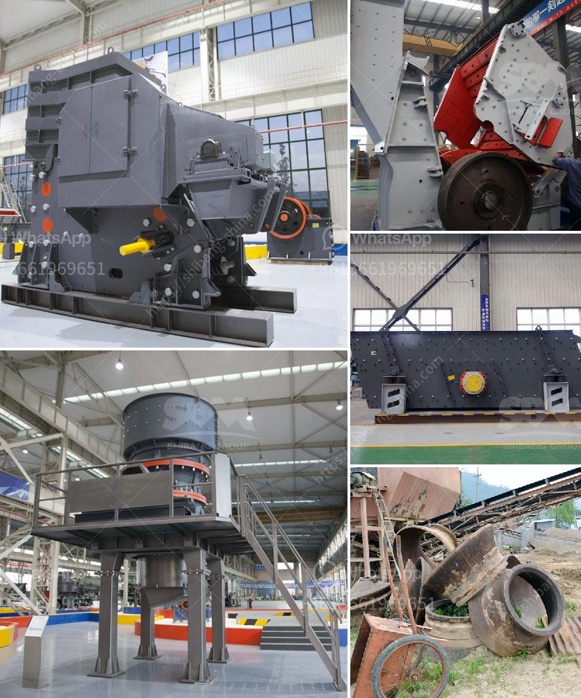

<h3>stone crushers from china</h3>
Stone crushers are extensively used in mining, metallurgy, building materials, highway, railway, water conservancy and chemical industries. They have the ability to crush medium or above medium hardness materials, making it versatile for various applications like quarrying, mining, construction, demolition, and recycling.

China's leading manufacturer of stone crushers, Shibo Machinery, has extensive experience in the production and sales of various types of stone crushers. We have a team of engineers who can recommend the most suitable models for customers based on their requirements. We ensure that each machine is tailored to meet the specific needs of our customers before shipment.

With over 30 years of experience in manufacturing stone crushers, Shibo Machinery has developed a wide range of crushers to meet the diverse needs of customers worldwide. Every year, over 600 sets of our stone crushers are delivered to countries around the world, including the United States, Canada, Australia, Russia, and Europe.

Our stone crushers are designed to achieve larger productivity and higher crushing ratio. We have jaw crushers, impact crushers, cone crushers, sand making machines, etc. They can be freely combined to meet various production needs.

Crushing equipment plays a vital role in the configuration of stone production lines. The large-scale stone production line usually uses multiple types of crushers for crushing. Jaw crushers are generally used for coarse crushing, cone crushers for intermediate crushing, and impact crushers for fine crushing and shaping.

The customer can choose the most suitable crusher according to the actual situation. Our crushers have high efficiency and stable performance, and they can evenly discharge particles with a high level of automation. Generally, our stone crushers can give you a wide range of choices.

Since our establishment, we have focused on the development, production, and sales of stone crushers. Our primary objective is to satisfy our customers' requirements and provide them with reliable, efficient, and economical machines. We have a professional after-sales team to promptly provide technical support and services to our customers.

Shibo Machinery's stone crushers are recognized for their excellent performance and quality. Our commitment to product innovation and continuous improvement has resulted in our machines being sold worldwide. With over 30 years of experience, we have built a reputation for delivering superior products and exceptional customer service.

In conclusion, stone crushers from China have a wide application in mining, metallurgy, construction, highways, railways, water conservancy, and chemical industries. The stationary stone crushers include jaw crusher, cone crusher, impact crusher, and mobile crusher. To cater the needs of the varying market and satisfy the clients' demand, the Company has developed quite a few advanced equipment and patented products such as jaw and powerful impact crushers, Superfine energy-saving crushers, Single section hammer crushers, and PMC Series high efficient vertical pulverizing mill etc.

We, at Shibo Machinery, are committed to providing reliable and efficient stone crushers and their related machinery. Our experienced team and professional after-sales service ensure that we provide the highest level of customer satisfaction. If you are in need of a stone crusher, please feel free to contact us. We are here to assist you in finding the most suitable solution for your specific requirements.
<h3>Contact us</h3><ul><li><strong>Whatsapp:&nbsp;<a href="https://wa.me/8613661969651">+8613661969651</a></strong></li><li><a href="https://swt.shibang-china.com/?git&amp;zhl&amp;stone crushers from china"><strong>Online Service(chat now)</strong></a></li></ul><h3>Related</h3><ul><li><a href='used crushers in germany for sale.md'>used crushers in germany for sale</a></li><li><a href='calcium oxide powder grinders.md'>calcium oxide powder grinders</a></li><li><a href='four roller mill.md'>four roller mill</a></li><li><a href='iron ore beneficiation plant.md'>iron ore beneficiation plant</a></li><li><a href='i need a second hand mobile stone crusher south africa.md'>i need a second hand mobile stone crusher south africa</a></li></ul>