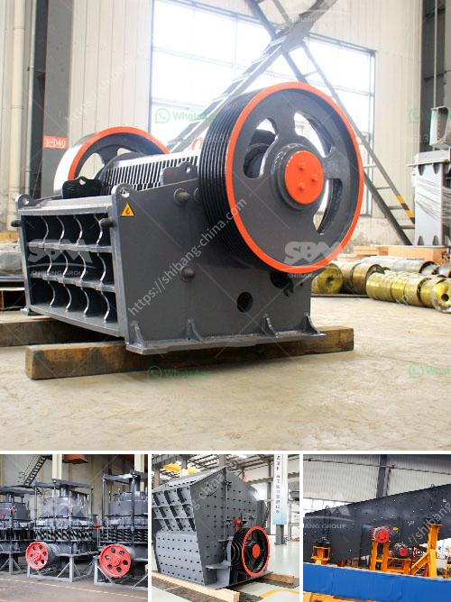

<h3>stone crushers gold</h3>
Stone crushers are used in the mining industry to break down large pieces of rock into smaller, more manageable stones. These machines have a variety of uses, such as crushing ores and rocks for road construction, building materials, and various other applications in the metals and mining industry. 

Gold mining is one of the key activities in the mining industry, and stone crushers are an essential tool for gold prospectors. The primary purpose of these machines is to break down large rocks into smaller, more manageable pieces that can be further processed to extract gold. 

Gold is a precious metal that has been highly valued throughout history. It is a symbol of wealth and prosperity, and many civilizations have sought to mine and possess this precious metal. Gold mining has a long and storied history, with the ancient Egyptians, Greeks, and Romans being known to engage in the extraction of gold. 

In modern times, gold mining has become a significant industry, with countries such as China, Russia, and the United States being major producers of gold. The process of extracting gold involves various stages, including exploration, mining, crushing, and refining. Stone crushers play a crucial role in the initial stages of this process. 

When large pieces of rock are mined from the earth, they are transported to stone crushers. These machines use powerful mechanical forces to break down the rocks into smaller, more manageable sizes. This initial crushing process is essential to ensure that the gold-bearing ores can be efficiently processed later on. 

The extracted ores are then processed further to separate the gold from the other minerals and impurities. Various techniques, such as gravity separation, flotation, and cyanidation, are used to extract gold from the ores. Stone crushers are utilized in this process to crush the ores into even smaller sizes, making it easier for the gold to be separated from the rest of the material. 

Stone crushers used in gold mining can vary in size and specifications, depending on the rock characteristics and the desired end product. Some crushers are mobile and can be moved to various locations, making it easier to transport the material and reduce hauling costs. 

In conclusion, stone crushers are essential machines in the gold mining industry. They are utilized to break down large rocks into smaller, more manageable sizes, facilitating the extraction of gold from the ores. These machines play a vital role in enabling the mining industry to efficiently extract and process this precious metal, contributing to economic growth and development. Without stone crushers, the gold mining process would be much more challenging and less efficient.
<h3>Contact us</h3><ul><li><strong>Whatsapp:&nbsp;<a href="https://wa.me/8613661969651">+8613661969651</a></strong></li><li><a href="https://swt.shibang-china.com/?git&amp;zhl&amp;stone crushers gold"><strong>Online Service(chat now)</strong></a></li></ul><h3>Related</h3><ul><li><a href='barium carbonate manufacturing process.md'>barium carbonate manufacturing process</a></li><li><a href='gypsum grinding machine.md'>gypsum grinding machine</a></li><li><a href='grinding machine for quartz stone.md'>grinding machine for quartz stone</a></li><li><a href='crusher plant price in ethiopia.md'>crusher plant price in ethiopia</a></li><li><a href='screw conveyor design calculation.md'>screw conveyor design calculation</a></li></ul>