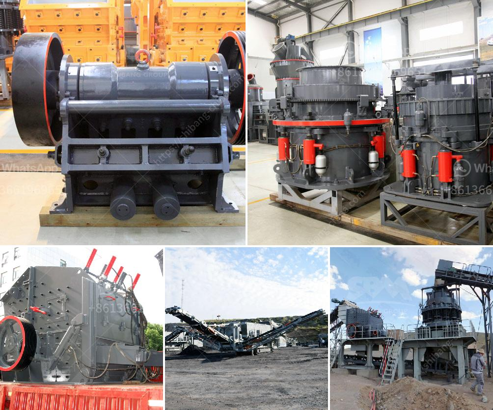

<h3>stone crushers poland</h3>
Stone crushers are machines used to crush rocks into smaller pieces, often called aggregates, for various construction purposes. Poland is a country with extensive mineral resources, including precious metals and stones, such as granite, marble, and basalt. The stone crushing industry plays a significant role in Poland's economy, contributing towards the country's infrastructure development and overall growth.

Poland has seen a remarkable surge in construction activities in recent years, driving the demand for stone aggregates. Stone crushers in Poland cater to this rising demand by converting larger rocks into smaller sizes suitable for construction use. These machines are commonly used in mining, quarrying, and recycling applications, where they play a vital role in breaking down larger materials into manageable sizes.

One of the primary advantages of stone crushers is their ability to process a wide range of materials. They can handle various types of rocks, including limestone, granite, basalt, and sandstone, among others. This versatility makes them highly sought after in the construction industry since different projects require different types of aggregates.

Stone crushers in Poland operate through different mechanisms, depending on the type of crusher. Jaw crushers are commonly used for primary crushing, where the rocks are initially broken down into smaller pieces. Cone crushers, on the other hand, work by crushing the rocks between an eccentrically rotating spindle and a concave bowl-shaped surface.

In recent years, there has been a growing focus on environmental sustainability in mining and construction activities. Stone crushers in Poland have adapted to this need by incorporating various eco-friendly features. For instance, many modern crushers are equipped with dust suppression systems to minimize the release of harmful dust particles into the environment. Additionally, some crushers are designed with advanced technology to reduce noise pollution.

The stone crushing industry in Poland has also witnessed advancements in automation and digitalization. Many crushers are now equipped with sensors and PLC systems to optimize performance and enhance safety. These technological advancements contribute to increased productivity, reduced downtime, and improved overall operational efficiency.

Poland's stone crushers are also subject to government regulations to ensure safe and responsible operations. Regulatory authorities monitor the industry to enforce compliance with safety standards, environmental regulations, and worker health and safety protocols. This helps protect the well-being of workers and minimize the adverse impacts on the environment.

In conclusion, stone crushers in Poland play a vital role in the country's construction industry. They convert larger rocks into smaller aggregates that are essential for infrastructure development. With their ability to process a wide range of materials and advancements in technology, these machines are crucial for meeting the growing demand for stone aggregates. As the industry strives towards environmental sustainability, stone crushers in Poland are adopting eco-friendly features and implementing regulatory compliance to ensure responsible operations.
<h3>Contact us</h3><ul><li><strong>Whatsapp:&nbsp;<a href="https://wa.me/8613661969651">+8613661969651</a></strong></li><li><a href="https://swt.shibang-china.com/?git&amp;zhl&amp;stone crushers poland"><strong>Online Service(chat now)</strong></a></li></ul><h3>Related</h3><ul><li><a href='crushers screeners conveyor manufacturers in india.md'>crushers screeners conveyor manufacturers in india</a></li><li><a href='feldspar grinding machine.md'>feldspar grinding machine</a></li><li><a href='limestone impact crusher.md'>limestone impact crusher</a></li><li><a href='sand mills for manufacturing.md'>sand mills for manufacturing</a></li><li><a href='turkey quarry crusher machines manufacturer.md'>turkey quarry crusher machines manufacturer</a></li></ul>