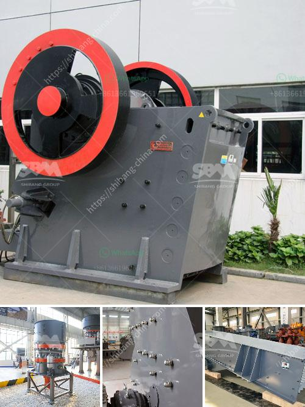

<h3>stone crushers sale south africa</h3>
Stone crushers are widely used in the mining, smelting, construction materials, highways, railways, water conservancy and chemical industries. With the development of the economy, the expansion of urban construction and the increasing demand for gravel aggregates, the sales volume of stone crushers is continuously growing in South Africa.

South Africa is a mineral-rich country, which has abundant mineral resources, such as iron ore, manganese ore, gold ore, copper ore, etc. Stone crushers play a vital role in the extraction of these minerals. Crushers help to crush the raw ore into smaller size, which can be further processed to get the desired metal or mineral.

There are various types of stone crushers available in South Africa, including jaw crushers, cone crushers, impact crushers, hammer crushers, and vertical shaft impact crushers. These crushers are used for crushing the raw material and obtaining the required product size. They can be used in stationary, semi-mobile, or mobile configurations.

One of the reasons why stone crushers are widely used in South Africa is that the government has greatly increased the investment in infrastructure projects. The construction of roads, bridges, buildings, dams, and railways all require a certain amount of aggregates, which are mainly produced by stone crushers.

In addition, stone crushers are also favored by the mining companies in South Africa. Many mining operations involve the extraction of hard rock, such as granite, limestone, and sandstone. These rock formations are ideal for mining, but they are also very hard and difficult to crush. Stone crushers with high crushing efficiency can greatly improve the production capacity and output of mining companies.

With the continuous development of the South African economy, there is a growing demand for stone crushers in various industries. The sales volume of stone crushers in South Africa is constantly increasing, which makes it a promising investment destination.

In conclusion, the stone crushers sale industry is booming in South Africa, which contributes to the economic prosperity and development of the country. The increasing demand for stone crushers indicates that the mining industry in South Africa is thriving, and the infrastructure construction projects are on the rise. The stone crushers play a vital role in these projects and contribute to the prosperity of the country.
<h3>Contact us</h3><ul><li><strong>Whatsapp:&nbsp;<a href="https://wa.me/8613661969651">+8613661969651</a></strong></li><li><a href="https://swt.shibang-china.com/?git&amp;zhl&amp;stone crushers sale south africa"><strong>Online Service(chat now)</strong></a></li></ul><h3>Related</h3><ul><li><a href='philippines crusher cebu crusher.md'>philippines crusher cebu crusher</a></li><li><a href='calcium carbonate plant.md'>calcium carbonate plant</a></li><li><a href='dolomite crusher equipment.md'>dolomite crusher equipment</a></li><li><a href='bell finlay crusher prices.md'>bell finlay crusher prices</a></li><li><a href='10 tpd grindig mill manufacturers philippines.md'>10 tpd grindig mill manufacturers philippines</a></li></ul>