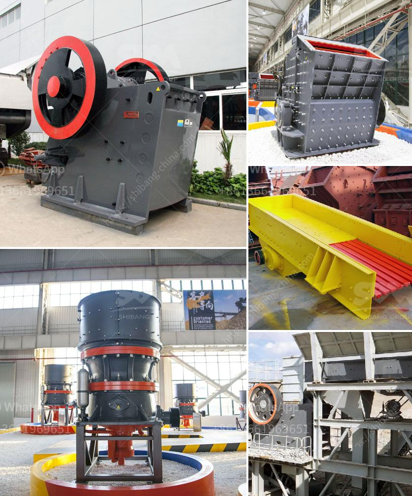

<h3>stone crushing business in pakistan</h3>
Stone crushing business is a lucrative venture for new entrepreneurs. The demand for quality stones is increasing day-by-day as infrastructure development projects and housing schemes are on the rise. In Pakistan, quarrying and crushing business is thriving and supporting the national economy with billions of rupees in revenue every year.

Dreaming to own a stone crusher business? Contact Nigeria Crusher to start your own stone crushing business. With minimal investment and maximum profit, you can become a successful entrepreneur in no time. The crushing process involves multiple stages from the manual crushing of stones to the final product. The crushed stones are used as raw materials for various construction activities.

Starting a stone crushing business requires extensive capital investment. However, the initial investment is worth it because the business is highly profitable and offers significant returns. The proposed project consists of various activities such as mining, crushing, and transportation to finally produce the stone chips required for the construction industry.

To start the stone crushing business, initially, the raw stone materials need to be gathered. Limestone, granite, basalt, sandstone, quartz, and other stones found in abundant quantities throughout the country serve as raw materials for the crushing process. The stone mines are usually located near the mountains, where the stones are extracted manually or through drilling and blasting techniques.

Once the stones are extracted, they are transported to the crushing units. Various types of machines such as jaw crushers, impact crushers, and cone crushers are used to crush the stones into desired sizes. Vibrating screens are used to separate the stones based on their size and shape.

After the crushing process, the stones are sorted and stored for further use. The crushed stones are used for various construction purposes, such as building roads, bridges, housing settlements, and commercial structures. The demand for crushed stones is always high, and there is a constant need for quality stone chips in the market.

The stone crushing business in Pakistan is concentrated mainly in the urban areas near major construction projects such as the Lahore-Karachi Motorway. The primary machinery involved in the stone crushing industry is Hammer Crusher, Vibrators, Rotor, Conveyors, and Support Structure. The process involved is to feed the stone in to the Hammer Crushers to make it further smaller in size as required by the customer. In the hammer crusher, the stone is crushed. The crushed stone is screened to separate the produce in different sizes by the separator. The crushed stone is conveyed to the vibrating screen for sieving.

As Pakistan's infrastructure development projects and housing schemes continue to surge, the demand for crushed stones will only continue to grow. There is an immense potential for entrepreneurs to invest in this industry and earn substantial profits. The stone crushing business in Pakistan provides employment opportunities for skilled and unskilled workers, contributing to the overall economic development of the country.

In conclusion, stone crushing business is a profitable venture for future entrepreneurs. Investment in plant and machinery for crushing stones is also considered to be a long-term, profitable and sustainable business. If you are passionate about this business, connect with Nigeria Crusher today to start your own stone crushing business in Pakistan.
<h3>Contact us</h3><ul><li><strong>Whatsapp:&nbsp;<a href="https://wa.me/8613661969651">+8613661969651</a></strong></li><li><a href="https://swt.shibang-china.com/?git&amp;zhl&amp;stone crushing business in pakistan"><strong>Online Service(chat now)</strong></a></li></ul><h3>Related</h3><ul><li><a href='how does it hammer mill operats.md'>how does it hammer mill operats</a></li><li><a href='impact pulverizer model sje25.md'>impact pulverizer model sje25</a></li><li><a href='conveyor belt manufactuer zimbabwe.md'>conveyor belt manufactuer zimbabwe</a></li><li><a href='selling cone crusher made in china.md'>selling cone crusher made in china</a></li><li><a href='iron ore processing pdf.md'>iron ore processing pdf</a></li></ul>