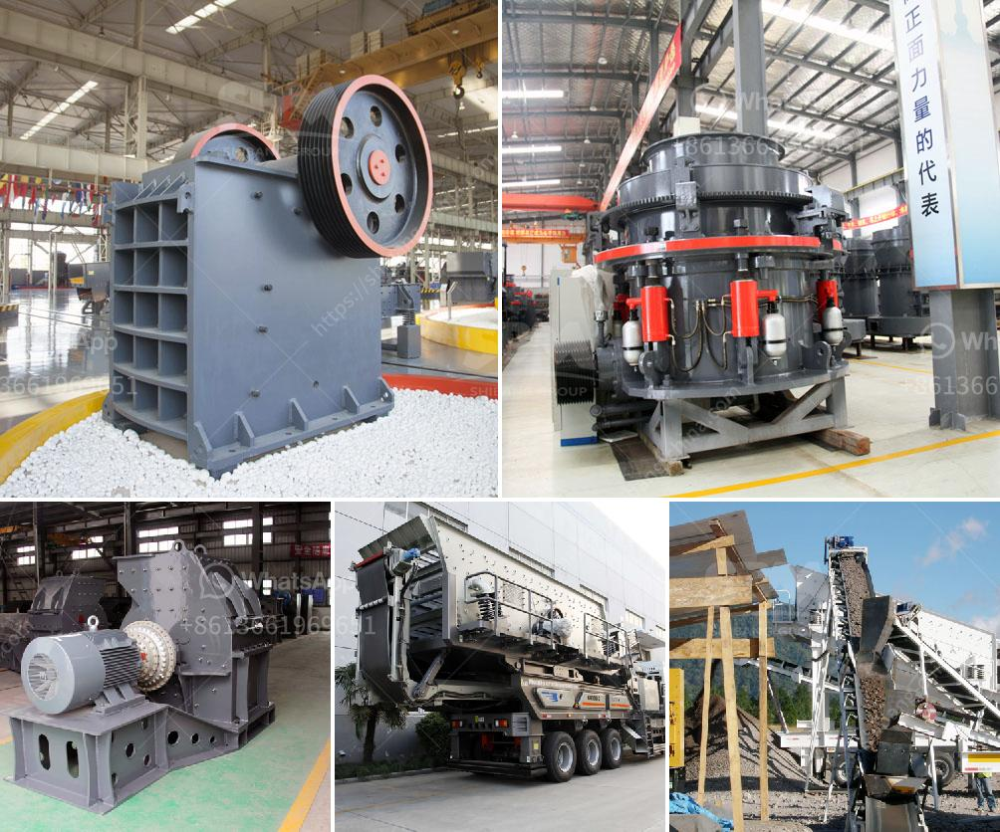

<h3>stone crushing equipment zenith</h3>
Stone crushing equipment has been widely used in various applications such as mining, metallurgy, building materials, highways, railways, water conservancy, chemical industry, and much more. Zenith stone crushing equipment is designed to achieve maximum productivity and high reduction ratio.

From large primary jaw crusher and impact crusher to cone crusher and VSI series for secondary or tertiary stone crushing, Zenith can supply the right crusher as well as complete crushing plant to meet your material reduction requirements. Zenith stands for quality, reliability, and productivity. With thousands of units operating in mines and quarries around the world, Zenith has the experience and capabilities to provide the top performance, throughput, and efficiency.

One of the key benefits of Zenith stone crushing equipment is its simple structure with the variety of mounting configurations available. Impact crushers can be used in both primary and secondary crushing applications without compromising crushing process. The jaw crushers are designed to exceed the primary crushing needs of customers in the mining, quarrying, and recycling industries.

One of the innovative features of Zenith stone crushing equipment is its advanced control system. The crusher automation allows adjusting the crusher settings to match the material feed size and capacity requirements. In addition, the hydraulic lifting and lowering feature enables the operator to adjust the crusher settings without the need for any tools. This results in reduced downtime and improved overall productivity.

Zenith stone crushers are equipped with a highly efficient and reliable motor and control panel that are easy to operate. The maintenance and servicing of these crushers are also hassle-free. With a simple and quick replacement process, the wear parts can be easily replaced reducing downtime and increasing operational efficiency.

The stone crushing equipment from Zenith is capable of processing a wide range of materials with different hardness levels. From limestone to basalt, from stone production to various ore crushing, it can provide unparalleled crushing performance in various medium, fine, and super-fine crushing operations.

In conclusion, Zenith stone crushing equipment offers great performance, flexibility, and ease of use varying from primary crushers to tertiary crushers. Furthermore, the advanced control system enables an operator to easily adjust the crusher settings without any difficulty. This, combined with excellent reliability and low maintenance requirements, makes Zenith stone crushing equipment the preferred choice for all crushing applications.
<h3>Contact us</h3><ul><li><strong>Whatsapp:&nbsp;<a href="https://wa.me/8613661969651">+8613661969651</a></strong></li><li><a href="https://swt.shibang-china.com/?git&amp;zhl&amp;stone crushing equipment zenith"><strong>Online Service(chat now)</strong></a></li></ul><h3>Related</h3><ul><li><a href='south africa limestone crushing and blending plant.md'>south africa limestone crushing and blending plant</a></li><li><a href='small ball mill for sale zimbabwe.md'>small ball mill for sale zimbabwe</a></li><li><a href='chrome mining business plan.md'>chrome mining business plan</a></li><li><a href='concrete aggregate recycle machine.md'>concrete aggregate recycle machine</a></li><li><a href='copper ore processing machines in usa.md'>copper ore processing machines in usa</a></li></ul>