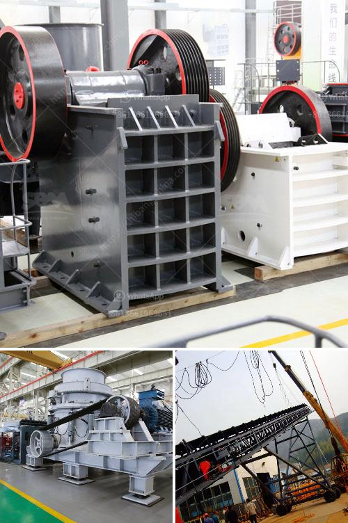

<h3>stone crushing in pakistan</h3>
Stone crushing industry is a dominant but still environmentally unorganized sector in Pakistan. Its different operations cause significant environmental impacts including air and noise pollution in the vicinity as well as vibration effects far-off. A major portion of the industry has been burnt out due to unauthorized and unregulated activities, leaving behind severe health and environmental hazards for the communities residing nearby.

The stone crushers scattered around the country are mainly located in the vicinity of urban areas such as Karachi, Lahore, Rawalpindi, Gujranwala, Peshawar, and Quetta. Due to the increasing construction activities, the emissions of dust and other pollutants from these units have significantly contributed to air pollution in these areas.

Moreover, the stone crushing industry exposes workers to deadly silica dust, making them vulnerable to lung diseases like silicosis, tuberculosis, and lung cancer. It is estimated that around 5 million workers are directly or indirectly working in this industry, facing life-threatening health hazards on a daily basis.

Although the government has implemented some regulations regarding stone crushing, they are poorly enforced due to corruption, lax monitoring, and lack of resources. Most of the stone crushing units operate without obtaining the necessary permissions from the concerned authorities, resulting in the destruction of natural habitats and deforestation.

The need of the hour is to promote awareness among the stone crushing industry regarding the potential environmental and health hazards associated with their activities. Strict regulations should be implemented and enforced to ensure that these units comply with the necessary guidelines. The government should provide financial incentives to encourage the adoption of cleaner technologies and promote sustainable practices in the stone crushing industry.

Additionally, community-based initiatives should be taken to ensure the well-being of the workers and their families. Regular health check-ups, provision of personal protective equipment, and access to healthcare facilities are some of the measures that can be taken to protect the workers from occupational hazards.

In conclusion, the stone crushing industry in Pakistan needs to be regulated and monitored on a regular basis. It is essential to address the environmental and health issues caused by this sector through strict enforcement of regulations, promotion of cleaner technologies, and provision of support to the affected communities. Only through these measures can we ensure sustainable development and a healthier future for Pakistan.
<h3>Contact us</h3><ul><li><strong>Whatsapp:&nbsp;<a href="https://wa.me/8613661969651">+8613661969651</a></strong></li><li><a href="https://swt.shibang-china.com/?git&amp;zhl&amp;stone crushing in pakistan"><strong>Online Service(chat now)</strong></a></li></ul><h3>Related</h3><ul><li><a href='jaw crushers price.md'>jaw crushers price</a></li><li><a href='mobile dms copper concentrate machine.md'>mobile dms copper concentrate machine</a></li><li><a href='process of talcum powder mill.md'>process of talcum powder mill</a></li><li><a href='stone crushers for sale usa.md'>stone crushers for sale usa</a></li><li><a href='rock crusher company.md'>rock crusher company</a></li></ul>