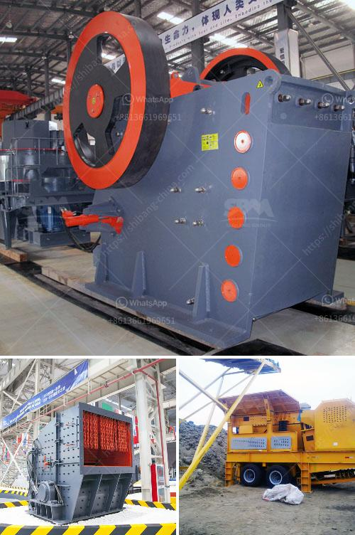

<h3>stone crushing machine prices za</h3>
Stone crushing machine has a wide range of applications, making it popular in the construction industry. There are affordable and expensive versions of these machines, but the prices vary depending on different factors. In South Africa, stone crushing machines are mainly used for different purposes such as crushing stones into aggregates for building material production, highway, railway, and water conservancy.

When it comes to stone crushing machines, the prices are determined by various factors including the production capacity, the type of machine, along with the brand and model. The production capacity has a direct impact on the machine price. Higher production capacities usually mean higher prices. Similarly, different types of machines also come with different price tags.

The most common types of stone crushing machines in South Africa include jaw crushers, large-scale impact crushers, and hammer crushers. These machines have different crushing functionalities and are used for different tasks, depending on the materials being crushed. Additionally, the brand and model of the machine also influence its price. Well-known brands and high-end models tend to have higher prices compared to lesser-known or older models.

In South Africa, stone crushing machine prices can vary significantly due to various factors. One of the most important factors is the region where the machine is purchased. The prices in urban areas are usually higher compared to rural areas due to higher living costs and demand for construction materials. Another factor is the availability of the machine. In areas with a high demand for crushing machines, the prices are likely to be higher due to increased competition.

Apart from that, the condition of the machine also impacts its price. New stone crushing machines tend to have higher prices compared to used or refurbished machines. However, it is important to note that used machines may have a shorter lifespan compared to new machines. Therefore, buyers need to consider the operational lifespan of the machine when making a purchasing decision.

It is always advisable to conduct thorough research before purchasing a stone crushing machine. Comparing prices from different suppliers and evaluating the features and specifications of the machine will help buyers make an informed decision. Additionally, buyers can also consider consulting experts and other industry professionals for guidance and advice.

In conclusion, stone crushing machine prices in South Africa are influenced by various factors such as production capacity, machine type, brand and model, region, availability, and condition. Considering all these factors is crucial for buyers to find the most suitable machine at the best possible price. By investing in a high-quality and efficient stone crushing machine, construction companies and contractors can enhance their productivity and efficiency, ultimately contributing to the growth of the industry.
<h3>Contact us</h3><ul><li><strong>Whatsapp:&nbsp;<a href="https://wa.me/8613661969651">+8613661969651</a></strong></li><li><a href="https://swt.shibang-china.com/?git&amp;zhl&amp;stone crushing machine prices za"><strong>Online Service(chat now)</strong></a></li></ul><h3>Related</h3><ul><li><a href='what is a mobile crusher.md'>what is a mobile crusher</a></li><li><a href='vertical grinding machine manufacturers.md'>vertical grinding machine manufacturers</a></li><li><a href='cement mill operation manual.md'>cement mill operation manual</a></li><li><a href='stamp mill for sale in south africa.md'>stamp mill for sale in south africa</a></li><li><a href='stone crusher machine factory in china.md'>stone crusher machine factory in china</a></li></ul>