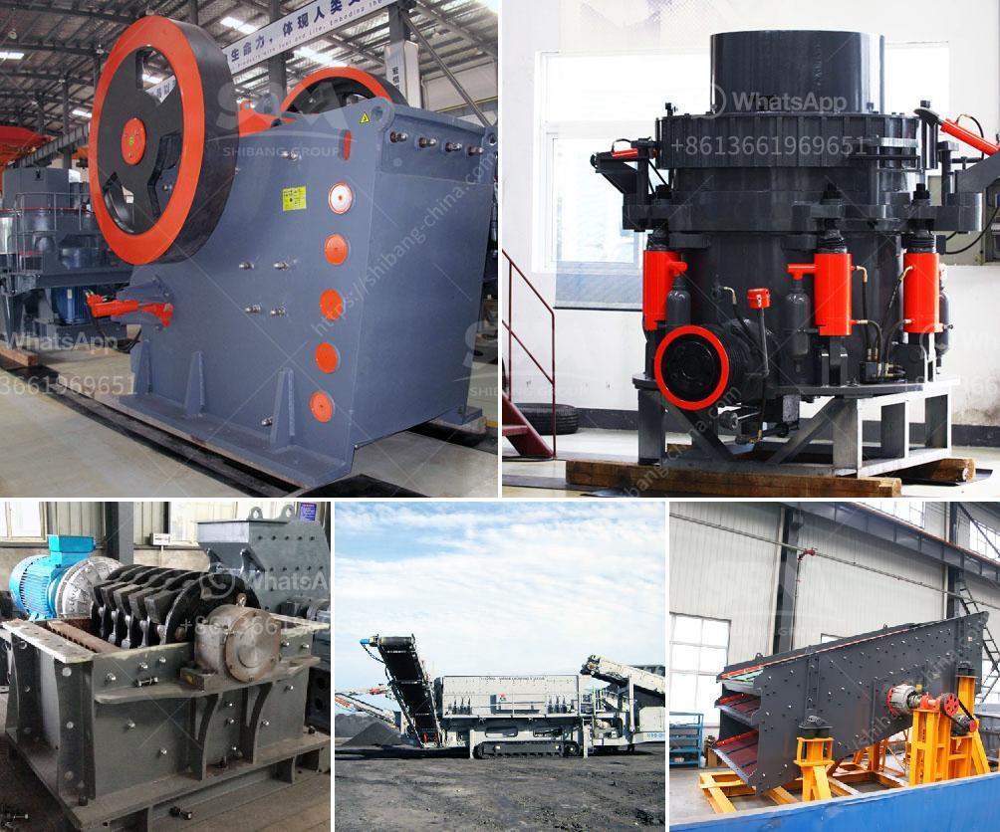

<h3>stone crushing machines in oman</h3>
Stone crushing machines are used in a number of areas, such as construction materials, mining, metallurgy, highways, chemistry, railways, etc. In Oman, a country located in the Arabian Peninsula, stone crushing machines are widely used due to the increasing demand for stone minerals. In Oman, stone crushing machines have been used for ages, and they are still popular today because of their low operating costs, easy installation and maintenance, and high productivity.

Oman, situated in the eastern part of the Arabian Peninsula, has a rich cultural heritage and a long history of civilization. The country is known for its vast reserves of various minerals, including limestone, gypsum, and marble. These minerals are widely used in the construction industry, making stone crushing machines an essential part of the infrastructure development in Oman.

One of the main reasons stone crushing machines are popular in Oman is their ability to crush hard and abrasive materials. These machines are designed to break down large stones into smaller pieces, which can then be used for various construction purposes. They can crush a wide range of materials, including limestone, dolomite, granite, basalt, and even harder rocks like quartzite.

Another reason stone crushing machines are widely used in Oman is the increase in road construction projects in the country. The government of Oman has been investing heavily in infrastructure development, including the construction of new highways and roads. Stone crushing machines play a vital role in the generation of aggregates, which are used as raw materials for various construction projects. These machines are capable of producing high-quality aggregates in large quantities, making them highly efficient and cost-effective.

The stone crushing machines in Oman also have an important role in the process of making concrete. The material used in the construction of buildings and infrastructure must be strong and durable. Concrete plays a crucial role in providing strength and stability to structures, and the aggregates produced by stone crushing machines are a key component of concrete production. The aggregates are mixed with cement and water to form concrete, which is then used for various construction purposes.

In conclusion, stone crushing machines have become an indispensable part of the construction industry in Oman. They are used to crush various materials, including limestone, dolomite, granite, basalt, and even quartzite, and produce high-quality aggregates. These aggregates are used in the construction of roads, buildings, and other infrastructure projects. Stone crushing machines play a crucial role in meeting the demands of the ever-growing construction industry in Oman. Their low operating costs, easy installation and maintenance, and high productivity make them the preferred choice for contractors and construction companies in the country.
<h3>Contact us</h3><ul><li><strong>Whatsapp:&nbsp;<a href="https://wa.me/8613661969651">+8613661969651</a></strong></li><li><a href="https://swt.shibang-china.com/?git&amp;zhl&amp;stone crushing machines in oman"><strong>Online Service(chat now)</strong></a></li></ul><h3>Related</h3><ul><li><a href='marble crushing line.md'>marble crushing line</a></li><li><a href='feldspar grinding machine.md'>feldspar grinding machine</a></li><li><a href='gold ore crusher machine.md'>gold ore crusher machine</a></li><li><a href='working scale model stone crusher.md'>working scale model stone crusher</a></li><li><a href='quote for vsi crusher.md'>quote for vsi crusher</a></li></ul>