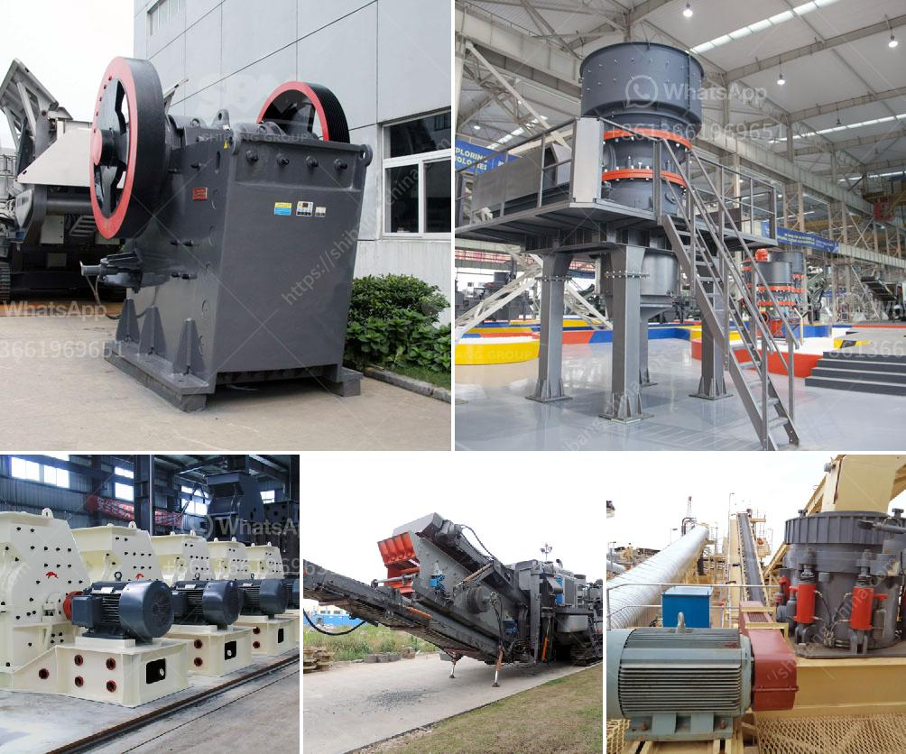

<h3>stone crushing plant for sale in south africa</h3>
Stone crushing plant for sale in South Africa plays a significant role in the mining industry as well as construction industry. In today's competitive market, it is essential for customers to have high-quality equipment, which can help them create higher value. Crushing plants are widely used in mines, construction sites, and quarries.

The stone crushing plant covers an area of about 20,000 square meters. It is located in Xingyang, Zhengzhou City, in the central part of China. The plant is mainly used to produce aggregate and sand for road construction and building construction. It consists of primary crushing, secondary crushing, and tertiary crushing processes, which are capable of crushing a variety of materials, including granite, basalt, limestone, river stone, sandstone, and other minerals.

There are several advantages of the stone crushing plant for sale in South Africa. Firstly, the plant can be easily transported to any site within a short time. Secondly, it can swiftly assist in crushing materials on-site, saving customers both time and money. Additionally, the plant is equipped with a dust suppression system, which effectively reduces dust pollution and improves air quality.

The stone crushing plant for sale in South Africa has a wide range of applications, and can be applied in various materials, such as limestone, river stone, granite, basalt, etc. It is widely used in construction sites, highways, railways, and many other industries. With reliable performance, reasonable design, convenient operation, and high efficiency, the plant is welcomed by customers all over the world.

One of the key features of the stone crushing plant for sale in South Africa is its high efficiency. It combines primary crushing, secondary crushing, and tertiary crushing into one set, which greatly improves the capacity and crushing efficiency. In addition, the plant is equipped with an intelligent control system, which can adjust the size of the discharge opening according to the specific requirements of customers. This ensures a high-quality final product with uniform particle size.

Safety is also a priority in the stone crushing plant. The plant is equipped with advanced safety devices, including emergency stops, guards, and safety locks. These measures effectively protect the safety of operators and prevent accidents. Furthermore, the plant is designed with ergonomic principles in mind, ensuring operators can work comfortably and efficiently.

In conclusion, the stone crushing plant for sale in South Africa is an ideal choice for construction sites, highways, railways, and many other industries. It is flexible, efficient, and reliable. It can save customers time and money while ensuring high-quality materials for their projects. With its advanced features and excellent performance, the stone crushing plant is undoubtedly a wise investment.
<h3>Contact us</h3><ul><li><strong>Whatsapp:&nbsp;<a href="https://wa.me/8613661969651">+8613661969651</a></strong></li><li><a href="https://swt.shibang-china.com/?git&amp;zhl&amp;stone crushing plant for sale in south africa"><strong>Online Service(chat now)</strong></a></li></ul><h3>Related</h3><ul><li><a href='small ball mill for sale zimbabwe.md'>small ball mill for sale zimbabwe</a></li><li><a href='mica powder machine.md'>mica powder machine</a></li><li><a href='zircon sand production line price.md'>zircon sand production line price</a></li><li><a href='bentonite granules making machinery india.md'>bentonite granules making machinery india</a></li><li><a href='cone crusher supply.md'>cone crusher supply</a></li></ul>