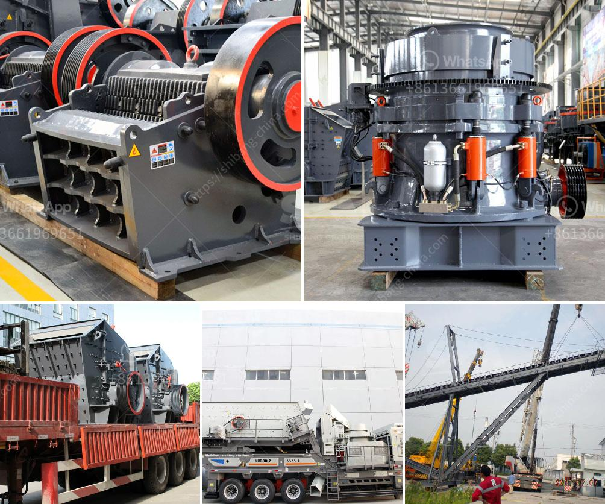

<h3>stone crushing plant of germany</h3>
Stone crushing plant is a stone production line designed to break large rocks into a variety of sizes and used for gravel or rock dust production. Stone crushing plants are classified according to their various uses and their functionality in the mining industry.

The crushing operations are commonly carried out in two stages, primary crushing and secondary crushing. The primary stage involves breaking down large rocks into smaller pieces, while the secondary stage involves further reducing the size of the materials to achieve the desired final product.

Germany, a country renowned for its engineering prowess, has been at the forefront of the stone crushing plant industry for decades. The stone crushing plant of Germany is well-known throughout the industry for its superior performance and durability. It is widely used in the mining, metallurgical, construction, road and railway industries.

One of the key advantages of the German stone crushing plant is its automation and control system, which allows for efficient and precise crushing operations. This ensures that the crushing process is carried out with the minimum amount of human intervention, reducing the chances of errors and increasing productivity.

Another advantage of the German stone crushing plant is its low energy consumption. The energy-efficient machinery used in the crushing process significantly reduces energy costs, resulting in lower operating expenses for the plant. This not only benefits the business financially but also contributes to a greener and more sustainable environment.

The German stone crushing plant is equipped with advanced technology and high-quality machinery, thereby ensuring both efficiency and reliability. The crushers and screens are designed to operate in harsh conditions, minimizing downtime and maximizing productivity. The plant is also equipped with effective dust suppression systems to reduce dust emissions and maintain a cleaner working environment.

In addition to its technological advancements, the German stone crushing plant offers a wide range of options to meet the specific needs of different customers. The plant can be customized to produce different grades and sizes of crushed stones, depending on the requirements of the end-user. This flexibility allows the plant to cater to a diverse range of projects, from small construction sites to large-scale infrastructure developments.

In conclusion, the stone crushing plant of Germany is a reliable and efficient crushing solution that combines high performance with low energy consumption. Its automated controls and advanced technology ensure efficient and precise crushing operations, while its flexibility and customization options make it suitable for a diverse range of projects. With its superior durability and low environmental impact, the German stone crushing plant is an ideal choice for any mining or construction project.
<h3>Contact us</h3><ul><li><strong>Whatsapp:&nbsp;<a href="https://wa.me/8613661969651">+8613661969651</a></strong></li><li><a href="https://swt.shibang-china.com/?git&amp;zhl&amp;stone crushing plant of germany"><strong>Online Service(chat now)</strong></a></li></ul><h3>Related</h3><ul><li><a href='gold stamp mill for sale in china.md'>gold stamp mill for sale in china</a></li><li><a href='company where they sell industrial mills.md'>company where they sell industrial mills</a></li><li><a href='fly ash grinding machine manufacturar in india.md'>fly ash grinding machine manufacturar in india</a></li><li><a href='gypsum grinding machine.md'>gypsum grinding machine</a></li><li><a href='cost of clinker grinding and cement plant.md'>cost of clinker grinding and cement plant</a></li></ul>