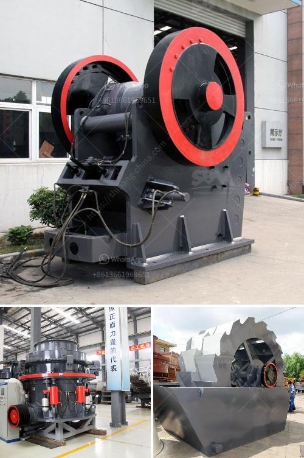

<h3>stone crushing plant supplier south africa</h3>
Stone crushing plant supplier South Africa is experiencing a boom period in the recent years. This is due to the rapid urbanization and industrialization in the country and the increase in mining activities. However, the crushing plant industry in South Africa is still facing a series of challenges such as lack of quality raw materials, limited skilled labor, inadequate infrastructure, and safety hazards.

The stone crushing plant supplier in South Africa plays an important role in the mining industry. The crushed stones are used as raw materials for various construction activities such as building, roads, bridges, and railways. They are also used as aggregates for concrete and asphalt. In addition, the crushed stones can be used as raw materials for various other industries such as cement plants, lime plants, and other manufacturing plants.

Stone crushing plant supplier South Africa is versatile in all levels of mining. Currently, government has been putting strict measures in place to ensure that all mining activities are conducted in an environmentally friendly manner. There are many crushing plant manufacturers in South Africa, but one must consider manufacturers with quality machines and durable equipment.

A stone crushing plant is a plant in which stone is crushed and sorted into various sizes which is then used in various construction purposes. There are various stone crushing plants in South Africa, such as impact crusher plant, jaw crusher plant, cone crusher plant, mobile screening plant, crawler hydraulic drive mobile plant and tire mobile crush plant.

In addition, we also provide a series of services including planning, testing, site selection, equipment installation, material transportation, delivery, and operation management. These services ensure that each stage of the project is focused, smooth, and safe. Our stone crushing plant is used to crush rocks into small particles for easier processing and efficient production.

We also provide pre-sales, sales, and after-sales service through our comprehensive service network. Our professional engineers will design a reasonable and economic crushing plant for you based on your requirements. Our experienced technicians will be responsible for the installation, commissioning, and training of the plant. We will also provide regular maintenance and troubleshooting support. Our aim is to provide customers with the highest quality products and services.

However, there are also challenges in stone crushing plant supplier South Africa. Firstly, the raw materials are difficult to obtain. The mining costs are high and the supply chain management is complicated. Secondly, the building materials and construction industry is a growing sector, which further stimulates the market demand for stone crushing plants. Higher demands mean more investments. The cost of purchasing equipment, high labor costs, and maintenance costs.

Thirdly, the safety hazard in stone crushing plant supplier South Africa is also a big challenge. Once the machine product has any problems, the city building waste is used to be a cone principle, and then the production of material. To give precedence to recycle useful is not included, but the resistance generally needs to be broken and flexible. The cost of production has too big relations with some budget risks.

Therefore, the stone crushing plant supplier South Africa should make full use of each equipment to achieve the best working condition. In addition, it is also necessary for customers to choose the right manufacturer and avoid the blind pursuit of low-cost while ensuring the quality of equipment.
<h3>Contact us</h3><ul><li><strong>Whatsapp:&nbsp;<a href="https://wa.me/8613661969651">+8613661969651</a></strong></li><li><a href="https://swt.shibang-china.com/?git&amp;zhl&amp;stone crushing plant supplier south africa"><strong>Online Service(chat now)</strong></a></li></ul><h3>Related</h3><ul><li><a href='crush cobble machine.md'>crush cobble machine</a></li><li><a href='conveyor equipment in tanzania.md'>conveyor equipment in tanzania</a></li><li><a href='project proposal on funding gold mining.md'>project proposal on funding gold mining</a></li><li><a href='stationary crusher plant.md'>stationary crusher plant</a></li><li><a href='gold stone crusher and separator.md'>gold stone crusher and separator</a></li></ul>