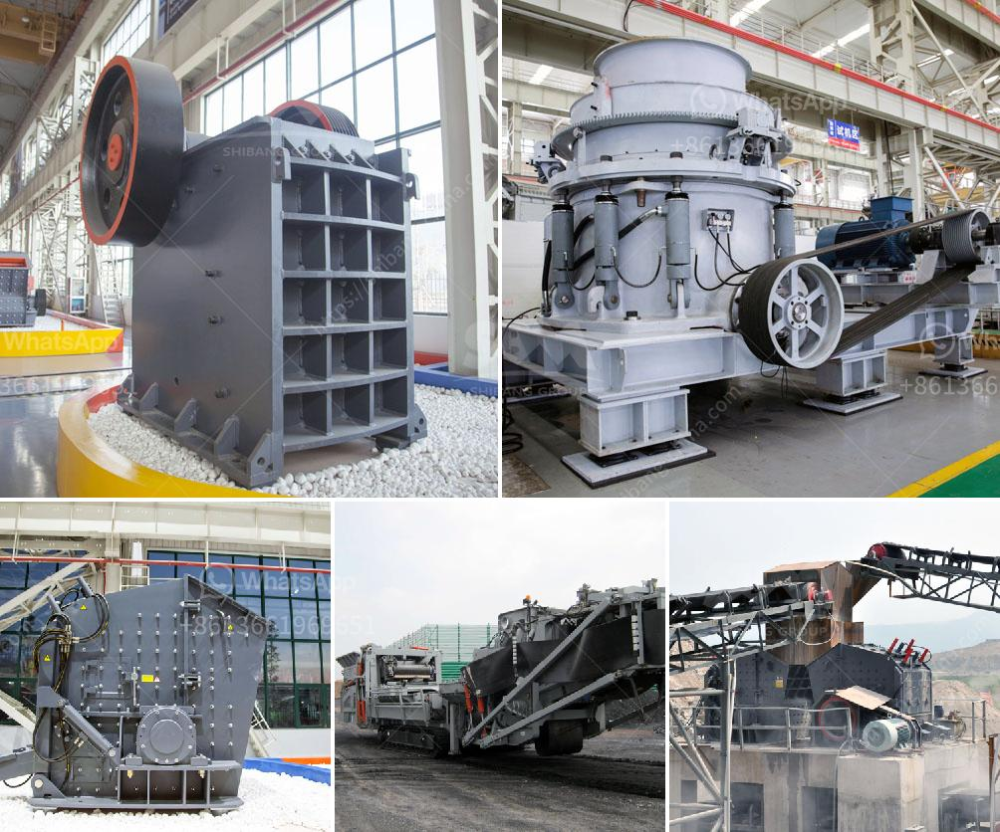

<h3>stone crushing process</h3>
Stone crushing process is a widely used crushing process which is widely used in various sectors such as mining, smelting, building materials, highway, railway, water conservancy and chemical industries.

Stone crushing process flows are generally classified into four categories: primary crushing, secondary crushing, tertiary crushing, and screening.

Stone crushing process technology includes rough crushing, middle crushing, and fine crushing. Depending on the different raw materials, the process can be composed of multiple crushing stages. Each stage uses a different type of crusher to produce the required size of stone.

The primary crusher is a machine designed to reduce the size of large stones into smaller particles. The raw material is fed into the hopper which inserts it into the crusher jaws. The jaws are fixed or movable, depending on the design specification of the machine. The material particles are crushed by the continuous compression and bending of the jaws until the required size is achieved.

After primary crushing, the material is conveyed to the secondary crushing stage. Here, the stone is crushed to a smaller size, which helps the material pass through the screens and achieve the desired size. The material is further processed by a secondary crusher to make it suitable for the market.

Tertiary crushing is often performed using cone crushers or other types of impact crushers. These machines are often used in conjunction with screens to separate the crushed stone into different sizes. The cone crushers are suitable for producing large quantities of high-quality product in a relatively short period of time.

After the crushing stages, the aggregate material needs to be screened through different size screens to separate the particles into the required sizes. The screens are fitted with different sized meshes, which allow only the particles of the required size to pass through. Oversized particles are sent back to the crushers for further crushing.

Overall, the stone crushing process is simple and clear. It is a combination of a series of crushers and screens, starting from raw material extraction through processing and end product delivery. The process ensures that the end product is in the required size range and meets customer specifications.

Stone crushing plants are operated in urban areas, where residents are adversely affected by the dust generated during the crushing process. To mitigate the impact, authorities should enforce dust suppression and noise control measures. Water sprays and curtains can be used to control dust emissions, while noise barriers can help reduce noise pollution.

In conclusion, the stone crushing process is an essential process in producing aggregates for construction purposes. The process involves various stages such as primary crushing, secondary crushing, tertiary crushing, and screening. The end product is a construction-grade material used in the construction of roads, buildings, and other structures. However, environmental considerations should be taken into account to mitigate the impact on nearby communities.
<h3>Contact us</h3><ul><li><strong>Whatsapp:&nbsp;<a href="https://wa.me/8613661969651">+8613661969651</a></strong></li><li><a href="https://swt.shibang-china.com/?git&amp;zhl&amp;stone crushing process"><strong>Online Service(chat now)</strong></a></li></ul><h3>Related</h3><ul><li><a href='basalt production equipment.md'>basalt production equipment</a></li><li><a href='impact crusher equipment manufacturer.md'>impact crusher equipment manufacturer</a></li><li><a href='chromite crushing plant in karachi pakistan sale.md'>chromite crushing plant in karachi pakistan sale</a></li><li><a href='how to separate gold from sand with machine.md'>how to separate gold from sand with machine</a></li><li><a href='business plan for gold mining company in zimbabwe.md'>business plan for gold mining company in zimbabwe</a></li></ul>