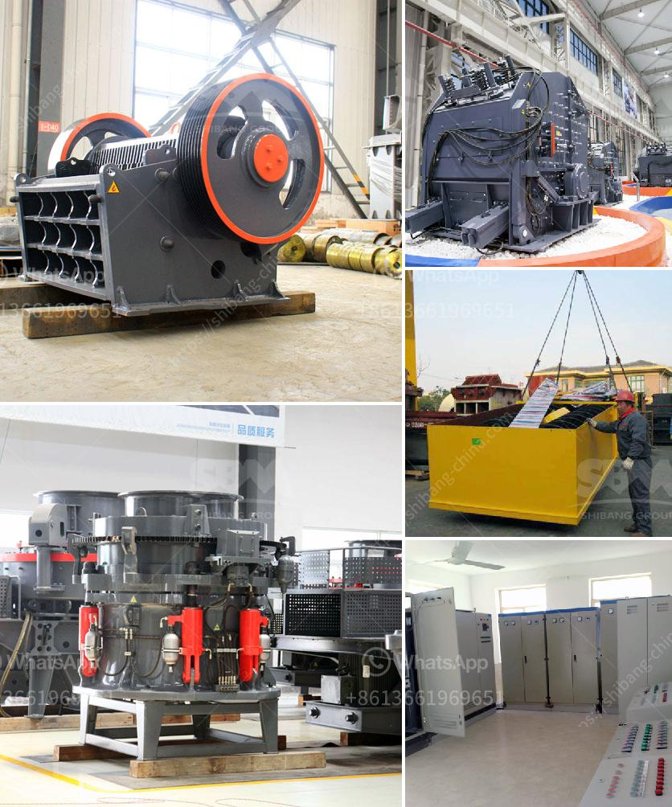

<h3>stone crushing turkey</h3>
Stone crushing industry is a crucial industrial sector in Turkey. The industry contributes to the national economy through the production of raw materials for various construction activities such as roads, bridges, buildings, and canals. Furthermore, it is an important sector in both urban and rural areas, providing employment opportunities for the local population.

Turkey has a rich history of stone crushing. Ancient structures, such as the Hagia Sophia in Istanbul and the ruins of Ephesus, bear witness to the craftsmanship and skill of Turkish stonemasons. Over the years, the industry has evolved and adapted to modern technology, becoming a key player in the country's economy.

The stone crushing process involves several stages, each capable of producing different sizes of crushed stones. The first stage is the extraction of raw materials from the quarry, where large blocks of stones are extracted using explosive charges or mechanical methods. These extracted stones are then transported to the crushing plants for further processing.

In the crushing plants, the stones are crushed into smaller sizes using various crushers, such as jaw crushers, impact crushers, and cone crushers. The crushed stones are then screened into different sizes to meet the specific requirements of construction projects. The final product, known as aggregate, is used as a base material for various construction applications.

One of the key features of the stone crushing industry in Turkey is its strong emphasis on environmental sustainability. The industry has adopted various measures to mitigate its impact on the environment. For instance, modern crushing plants are equipped with dust suppression systems to control the spread of dust particles during the crushing process. Additionally, water sprinklers are used to minimize dust emissions and to enhance the overall environmental performance of the industry.

The stone crushing industry in Turkey also plays a significant role in promoting the use of recycled aggregates. Recycling of construction materials is essential for reducing the demand for natural resources and minimizing waste generation. The industry encourages the use of recycled aggregates in various construction projects, thus contributing to a more sustainable and circular economy.

Furthermore, the stone crushing industry in Turkey has been instrumental in the development of the country's infrastructure. The production of crushed stones provides raw materials for the construction of roads, bridges, and buildings, which are crucial for economic growth and development. The industry also stimulates economic activity by creating employment opportunities for the local population.

In conclusion, the stone crushing industry in Turkey is an important sector that contributes to the national economy through the production of raw materials for construction activities. The industry has evolved and embraced modern technology while promoting sustainability and the use of recycled aggregates. Moreover, it plays a vital role in the development of the country's infrastructure, ensuring economic growth and providing employment opportunities.
<h3>Contact us</h3><ul><li><strong>Whatsapp:&nbsp;<a href="https://wa.me/8613661969651">+8613661969651</a></strong></li><li><a href="https://swt.shibang-china.com/?git&amp;zhl&amp;stone crushing turkey"><strong>Online Service(chat now)</strong></a></li></ul><h3>Related</h3><ul><li><a href='crusher 300 sampai 400 ton dan hr dijual.md'>crusher 300 sampai 400 ton dan hr dijual</a></li><li><a href='jual jaw crusher kenya.md'>jual jaw crusher kenya</a></li><li><a href='small concrete crushers for low capacity.md'>small concrete crushers for low capacity</a></li><li><a href='industrial uses of white marble powder.md'>industrial uses of white marble powder</a></li><li><a href='mobile crushing stone machines from austria.md'>mobile crushing stone machines from austria</a></li></ul>