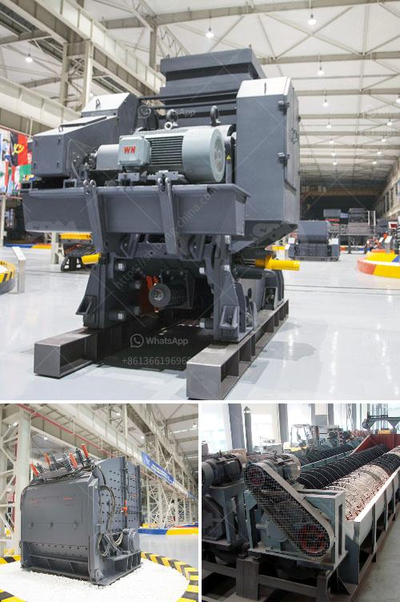

<h3>stone crushing units</h3>
Stone crushing units can be seen in almost every major city or town in the country, resulting in a massive influx of dust and pollution. In fact, there are over 12,000 stone crusher units in India.

The stone crushing units are heavily located in breaching zones and forest sections of South and Central India, which makes it all the more significant to enforce stricter regulations in these areas. The dust and pollution from these units are not only harmful to human health, but they also disrupt the ecosystem, causing irreversible damage to the environment.

The stone crushing units primarily emit particulate matter (PM), and PM10, which are known to cause severe respiratory illnesses and lung diseases. The incessant exposure to dust and noise pollution, generated by these units, leads to higher incidences of respiratory diseases like asthma and tuberculosis among the workers. Additionally, the fine dust particles can also cause long-term health issues, including lung cancer and cardiovascular diseases.

Furthermore, the environmental impact of these units is equally concerning. The dust pollution coming from these stone crushing units settles on agricultural fields, rendering them unfit for cultivation. The agricultural produce may also get contaminated, leading to a fall in quality. This poses a threat to food security and overall agricultural productivity.

The stone crushing units also create noise pollution that affects the physical and psychological well-being of nearby residents. The constant drilling and crushing activities can cause high levels of stress and anxiety among the people living within a certain radius of these units. The sleep patterns and overall quality of life of these residents are significantly compromised.

Taking into account the detrimental consequences of stone crushing units, it becomes crucial to find sustainable solutions. Here are some possible measures that can be taken to mitigate the impact of these units:

1. Strict regulations and enforcement: The authorities must introduce stricter regulations and enforce them effectively to ensure that stone crushing units adhere to environmental standards. Stringent monitoring should be conducted to ensure compliance.

2. Installation of dust control measures: Stone crushing units should be mandated to install dust suppression systems or water sprinklers to minimize dust emissions and prevent it from spreading to neighboring areas.

3. Provision of protective gear: Workers in stone crushing units should be provided with proper protective gear like masks and gloves to safeguard their health from dust and noise pollution.

4. Education and awareness campaigns: There is a need for education and awareness campaigns to highlight the harmful effects of stone crushing units on human health and the environment. This will help in mobilizing public opinion and pressurizing authorities to take necessary action.

5. Alternative solutions: Exploring alternative materials for construction and building purposes can reduce the reliance on stone crushing units. Utilizing recycled materials or promoting the use of locally available resources can help in mitigating the demand for stone crushing units.

In conclusion, stone crushing units have become a necessary evil in our society. However, their operations must be strictly regulated to minimize the adverse impacts on human health and the environment. By implementing the suggested measures, we can ensure a better future for both the workers and residents in the vicinity of these units.
<h3>Contact us</h3><ul><li><strong>Whatsapp:&nbsp;<a href="https://wa.me/8613661969651">+8613661969651</a></strong></li><li><a href="https://swt.shibang-china.com/?git&amp;zhl&amp;stone crushing units"><strong>Online Service(chat now)</strong></a></li></ul><h3>Related</h3><ul><li><a href='silica sand production plant in germany.md'>silica sand production plant in germany</a></li><li><a href='ball mill operating rpm calculation.md'>ball mill operating rpm calculation</a></li><li><a href='composition of ball mill liner.md'>composition of ball mill liner</a></li><li><a href='gypsum import from bhutan.md'>gypsum import from bhutan</a></li><li><a href='used stone crushers dealer.md'>used stone crushers dealer</a></li></ul>