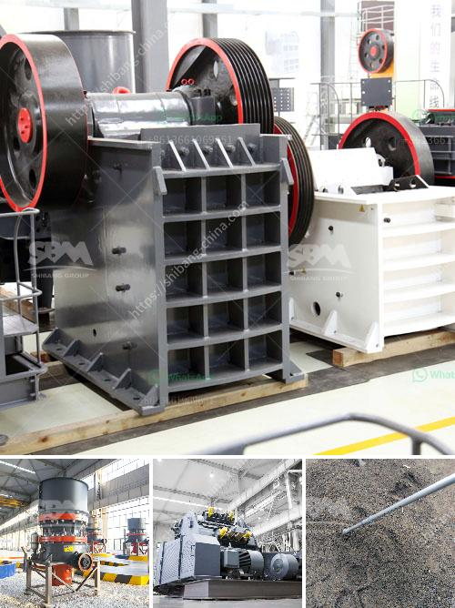

<h3>stone grinding machine type raymond mill price</h3>
Raymond mill is commonly used in mining industry, mainly for grinding materials into fineness of various powder. Raymond mill belongs to equipment in the field of grinding equipment, and its grinding range is very wide. Raymond mill is mainly used for grinding limestone, marble, calcite, dolomite, barite, talc, gypsum, diabase, quartz stone, bauxite and other non-metallic minerals. The whole machine is a vertical structure with a small footprint and strong systematicness. It can be used as an independent production system from raw material roughing to conveying to milling and final packaging. Compared with other grinding equipment, the screening rate is as high as 99%.

The Raymond mill has many different types, such as HGM ultrafine grinding mill, YGM high pressure grinding mill, and MTW European version grinding mill, etc. Raymond mill is also called stone grinding machine or stone milling machine. Compared with other milling equipment, Raymond mill has a higher screening rate in the production process. Generally speaking, the fineness of the finished powder is relatively high, which can reach 80-400 mesh, and the pass rate of 200 mesh is also relatively high.

The price of Raymond mill is affected by many factors, such as the manufacturer, quality, technical level, region, etc. Different manufacturers produce different types of Raymond mills with different technical levels, and the quality and performance of the equipment are also different. In addition, the region also has a certain influence on the price of Raymond mill. Different regions have different consumption levels and market competition, which will also cause differences in Raymond mill prices.

The price of Raymond mill is mainly influenced by its production cost. The production cost of the equipment includes not only the cost of raw materials, but also the labor cost, research and development cost, advertising cost, depreciation cost, etc. Therefore, the price of Raymond mill is not fixed, but will fluctuate to a certain extent with the change of cost.

Compared with other grinding equipment, the price of Raymond mill with the same production capacity and production fineness is relatively high. However, the overall investment cost of Raymond mill is lower than that of other grinding equipment. The one-time investment is small, and the production cost is low. Therefore, considering the long-term use, the price of Raymond mill is still very cost-effective.

In summary, Raymond mill is a widely used stone grinding machine. It can grind various minerals into powder with different fineness. The price of Raymond mill is affected by many factors, such as manufacturer, quality, technical level, region, etc. Although the price of Raymond mill is relatively high, the overall investment and production cost are low, which is very cost-effective in the long run. I believe that with the continuous improvement of technology, the price of Raymond mill will become more affordable, bringing more benefits to users.
<h3>Contact us</h3><ul><li><strong>Whatsapp:&nbsp;<a href="https://wa.me/8613661969651">+8613661969651</a></strong></li><li><a href="https://swt.shibang-china.com/?git&amp;zhl&amp;stone grinding machine type raymond mill price"><strong>Online Service(chat now)</strong></a></li></ul><h3>Related</h3><ul><li><a href='conveyor belting manufacturers.md'>conveyor belting manufacturers</a></li><li><a href='aggregate quarry plant.md'>aggregate quarry plant</a></li><li><a href='limestone crusher plant price in india.md'>limestone crusher plant price in india</a></li><li><a href='crusher stone crusher 1 ton peru.md'>crusher stone crusher 1 ton peru</a></li><li><a href='the production process of cobblestone.md'>the production process of cobblestone</a></li></ul>