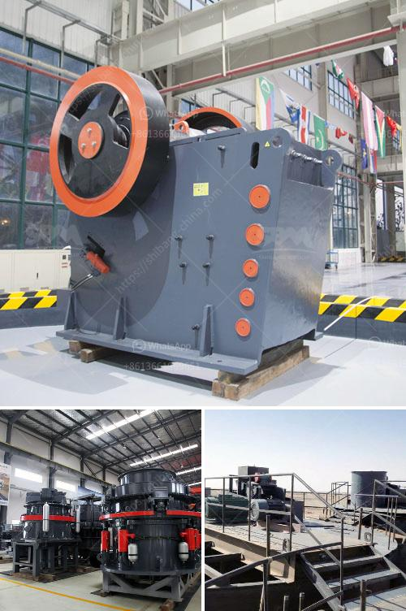

<h3>stone jaw crusher</h3>
A stone jaw crusher is a versatile machine that has the ability to crush rocks and produce a variety of materials. It is a cost-effective investment tool that is often used for industrial purposes. Some of the key features of these machines include:

1. Versatility: Stone jaw crushers are used extensively throughout various industries due to their ability to crush different types of materials. They can process ores, minerals, rocks, and other materials with varying hardness levels. This makes them suitable for a wide range of applications, from mining and construction to recycling and demolition.

2. High crushing capacity: Stone jaw crushers are known for their high crushing capacity, which enables them to process large quantities of materials efficiently. This is crucial for industries that require a continuous supply of crushed materials. The powerful jaws of these machines can crush even the hardest rocks, ensuring a consistent and reliable output.

3. Energy efficiency: Stone jaw crushers are designed to be highly energy-efficient. They use less energy compared to other types of crushers, making them environmentally friendly. This not only reduces energy consumption but also lowers operating costs. Industries can save a significant amount on electricity bills while still achieving high productivity levels.

4. Easy maintenance: Stone jaw crushers are relatively easy to maintain. They have simple mechanisms, making it easier for operators to troubleshoot and repair any issues that may arise. Regular maintenance, such as lubrication and checking for wear and tear, can help prolong the lifespan of these machines. This ensures uninterrupted production and avoids costly breakdowns.

5. Safety features: Stone jaw crushers are built with safety in mind. They are equipped with safety mechanisms to prevent accidents and injuries. For example, some machines are designed with a release system that allows the jaw to open and close easily, reducing the risk of trapping materials or fingers. Additionally, many crushers are equipped with a guard to protect the operator from flying debris.

6. Compact design: Stone jaw crushers are available in various sizes, making them suitable for both small and large-scale operations. Their compact design allows them to be easily transported and installed in different locations. This versatility means that industries can quickly set up and start using these machines without much hassle.

In conclusion, a stone jaw crusher is an essential tool for the mining industry. It offers a range of benefits that allow businesses to increase productivity and reduce operating costs. Its versatility, high crushing capacity, energy efficiency, easy maintenance, safety features, and compact design make it an ideal choice for various applications. Whether it is for mining, construction, or recycling purposes, a stone jaw crusher is a valuable investment that can help businesses thrive.
<h3>Contact us</h3><ul><li><strong>Whatsapp:&nbsp;<a href="https://wa.me/8613661969651">+8613661969651</a></strong></li><li><a href="https://swt.shibang-china.com/?git&amp;zhl&amp;stone jaw crusher"><strong>Online Service(chat now)</strong></a></li></ul><h3>Related</h3><ul><li><a href='250tph cone crusher price.md'>250tph cone crusher price</a></li><li><a href='bradley grinding mill price.md'>bradley grinding mill price</a></li><li><a href='products of formulation for two roll mill.md'>products of formulation for two roll mill</a></li><li><a href='manufactures hammer mills.md'>manufactures hammer mills</a></li><li><a href='used stone crusher for sale europe.md'>used stone crusher for sale europe</a></li></ul>