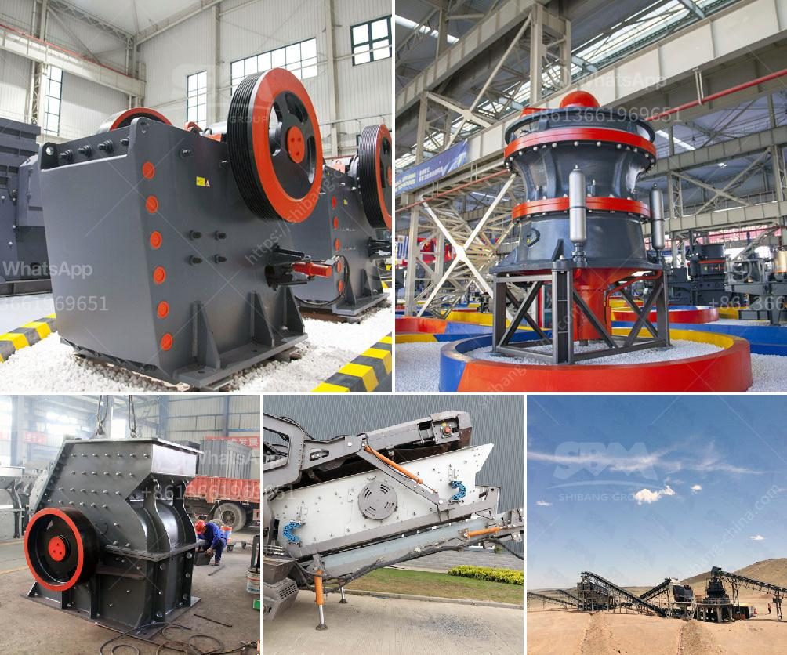

<h3>stone paper production process</h3>
Stone paper, often called rock paper or mineral paper, is a unique and eco-friendly alternative to traditional wood pulp paper. Made primarily from calcium carbonate, obtained from limestone, stone paper offers several advantages in terms of production and environmental impact.

The production process of stone paper begins with quarrying limestone, which is then crushed into a fine powder. This powder goes through a series of chemical reactions to remove impurities and create calcium hydroxide, commonly known as slaked lime. The slaked lime is then mixed with water to produce a paste-like substance.

Next, the paste is spread onto a plastic-lined conveyor belt. As the belt moves, excess water is drained away, leaving behind a thin layer of calcium carbonate. This layer is then dried and further solidified through a process of heat and pressure.

Once the stone paper is completely dried, it is ready for use. It can be cut and perforated, just like traditional paper, and can be used for a variety of applications such as writing, packaging, and even wallpaper.

The production process of stone paper offers several advantages over traditional paper production. First and foremost, it requires no trees to be cut down, making it a more sustainable option. In addition, stone paper production consumes significantly less water and energy compared to the production of wood pulp paper. Furthermore, the production of stone paper emits less carbon dioxide and other harmful gases, reducing its impact on global warming.

Moreover, stone paper is highly durable and resistant to tearing, water, and grease. It does not need to be laminated to achieve these properties, making it a more eco-friendly option compared to laminated papers. Stone paper is also recyclable and can be reprocessed to create new stone paper products.

In conclusion, the production process of stone paper offers a sustainable and environmentally friendly alternative to traditional paper production. Its unique properties and low carbon footprint make it an innovative solution to reduce the dependence on natural resources and make a positive impact on our planet.
<h3>Contact us</h3><ul><li><strong>Whatsapp:&nbsp;<a href="https://wa.me/8613661969651">+8613661969651</a></strong></li><li><a href="https://swt.shibang-china.com/?git&amp;zhl&amp;stone paper production process"><strong>Online Service(chat now)</strong></a></li></ul><h3>Related</h3><ul><li><a href='as selecting a hammer mill.md'>as selecting a hammer mill</a></li><li><a href='black powder ball mill grinder.md'>black powder ball mill grinder</a></li><li><a href='belt and conveyor distributor in indonesia.md'>belt and conveyor distributor in indonesia</a></li><li><a href='crusher price in europe.md'>crusher price in europe</a></li><li><a href='sand crusher machinery china.md'>sand crusher machinery china</a></li></ul>