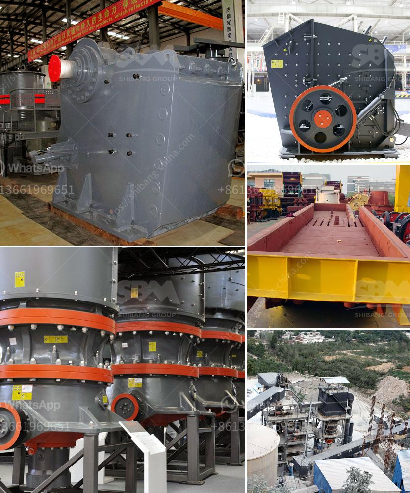

<h3>stone quarry crusher machine</h3>
Stone quarry crusher machine plays an important role in the construction industry. The stone crusher machine is widely used in mining, metallurgy, building materials, road, railway, water conservancy and chemical industries. The increasing demand for gravel aggregate has stimulated the development of the quarry crusher machine industry. The quarry crusher machine is dedicated to the quarry, which produces stones of different sizes for various construction purposes.

Typically, the stone crushing machine consists of jaw crusher, impact crusher, cone crusher and VSI crusher, among them, the jaw crusher is the most commonly used primary crushing equipment. The jaw crusher is mainly used for coarse crushing of raw materials. It has a large crushing ratio and improves the output capacity. It has simple structure, convenient maintenance and low production cost. The impact crusher is used for secondary crushing and has a higher reduction ratio, while the cone crusher is used for fine crushing and mainly used for pre-crushed stones. The VSI crusher is the third generation of sand making machine and is used for artificial sand making. The quarry crusher equipment is the essential equipment in the stone quarry crushing line. Therefore, the importance of quarry crusher equipment is quite clear.

In general, gravel machinery includes:Jaw Crusher , impact crusher, hammer crusher, cone crusher,ZS Vertical Shaft Impact Crusher, etc. Camelway, with 30 years of production experience, is widely used in the production of sand and gravel for its advantages of moderate size of finished crushed stone particles and long lifetime of wearing parts. Considering the large-sized machinery, we recommend using our PE series jaw crusher and PEX series fine jaw crusher. This crusher has a serrated jaw plate to reduce the amount of dust produced by the jaw plate during operation. It is used to bury the road and the subgrade materials with good drainage conditions and stable foundations. The product has a size of less than 5mm and can be used for dust suppression during the construction of the base layer and the chip sealing layer.

The stone quarry crusher machine is not only used in quarrying industries but also applied in construction waste and municipal waste crushing industries. Raw materials such as limestone, granite, basalt, river pebbles, concrete, and construction waste can be processed and transformed into high-quality aggregates used in various fields of construction. The waste materials made from these construction projects can also be recycled and used again.

With the global push for sustainable development, stone quarry crusher machine has also become an eco-friendly product in the market. The stone quarry crushing machine requires very little maintenance and is highly efficient. The energy-saving features of the machine make it environmentally friendly and cost-effective. In addition, the machine is built to have a long service life and can be easily maintained and serviced.

In conclusion, stone quarry crusher machine provides a vital support base for construction projects. The importance of quarry crusher equipment in the building industry cannot be underestimated. However, its benefits are accompanied by some negative aspects such as noise pollution, dust emissions, and water pollution. Therefore, quarry operators should take measures to minimize the impact of their operations on the environment and surrounding communities. With proper management and regulation, the quarry crusher industry can continue to contribute to the development of sustainable construction practices.
<h3>Contact us</h3><ul><li><strong>Whatsapp:&nbsp;<a href="https://wa.me/8613661969651">+8613661969651</a></strong></li><li><a href="https://swt.shibang-china.com/?git&amp;zhl&amp;stone quarry crusher machine"><strong>Online Service(chat now)</strong></a></li></ul><h3>Related</h3><ul><li><a href='rock miller machine.md'>rock miller machine</a></li><li><a href='japan granite machine.md'>japan granite machine</a></li><li><a href='used stone crushers dealer.md'>used stone crushers dealer</a></li><li><a href='sand screening plants in south africa.md'>sand screening plants in south africa</a></li><li><a href='project report on stone crushing unit.md'>project report on stone crushing unit</a></li></ul>