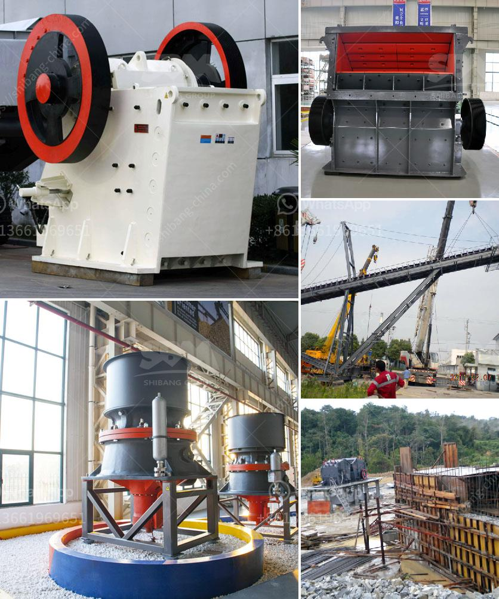

<h3>study on sand making machine in nigeria</h3>
The mining industry is one of the major contributors to the economic growth and development of Nigeria. In recent years, this sector has witnessed significant advancements, particularly in the extraction and processing of various mineral resources. Sand, an essential component in construction and manufacturing, has experienced a surge in demand. To meet this requirement, the utilization of sand making machines has become crucial, prompting a comprehensive study on the sand making machine market in Nigeria.

Nigeria, being a country abundant in sand deposits, has experienced a steady rise in sand mining activities. Unfortunately, these operations are often unregulated, leading to environmental degradation and limited access to quality sand. Recognizing this challenge, the Nigerian government has begun implementing policies to encourage responsible sand mining and promote the use of sand making machines for effective sand production.

1. Cost-effectiveness: Sand making machines efficiently convert raw materials into quality sand at a lower cost compared to traditional methods. This innovative technology reduces the need for manual labor, ultimately reducing overall production expenses and increasing profitability for businesses in Nigeria.

2. High-quality sand production: Sand produced by these machines is consistent in grain size, free from impurities, and suitable for a wide range of applications in the construction industry. The use of sand making machines ensures that manufactured sand meets required specifications, contributing to the overall durability and strength of construction projects.

3. Environmental conservation: A key advantage of sand making machines is their ability to minimize environmental impact. Unlike traditional sand extraction methods, these machines are designed to reduce the exploitation of natural resources, safeguarding ecosystems and preserving the delicate balance of flora and fauna.

Despite the benefits, there are several challenges hindering the widespread adoption of sand making machines in Nigeria:

1. Lack of awareness: Many small-scale miners and construction companies remain unaware of the benefits of sand making machines due to limited exposure to modern technologies. Education and awareness campaigns are necessary to highlight the advantages and encourage their uptake.

2. Limited access to financing: The high cost of acquiring sand making machines poses a significant challenge to the local market. Collaborations between financial institutions and manufacturers could provide accessible financing options and encourage the purchase of these machines.

3. Technical expertise: Adequate technical expertise is required for operating and maintaining sand making machines. Training programs and workshops should be organized to develop the necessary skills among employees in the mining and construction sectors.

A comprehensive study on sand making machines in Nigeria reveals their immense potential in meeting the growing demand for quality sand, while also addressing environmental concerns. The government, in collaboration with relevant stakeholders, should prioritize the implementation of policies encouraging responsible sand mining and the adoption of sand making machines. By doing so, the country can achieve sustainable development, economic growth, and environmental conservation in the mining sector.
<h3>Contact us</h3><ul><li><strong>Whatsapp:&nbsp;<a href="https://wa.me/8613661969651">+8613661969651</a></strong></li><li><a href="https://swt.shibang-china.com/?git&amp;zhl&amp;study on sand making machine in nigeria"><strong>Online Service(chat now)</strong></a></li></ul><h3>Related</h3><ul><li><a href='stone crusher conveyor belts cost.md'>stone crusher conveyor belts cost</a></li><li><a href='lay out calcium carbonate plant.md'>lay out calcium carbonate plant</a></li><li><a href='cement factories for sale in pakistan.md'>cement factories for sale in pakistan</a></li><li><a href='price list of sand manufacturing machine india.md'>price list of sand manufacturing machine india</a></li><li><a href='ball india ball mills 220 tph.md'>ball india ball mills 220 tph</a></li></ul>