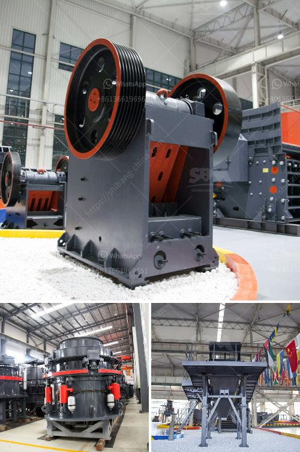

<h3>suplier sand making machine from philippines</h3>
The Philippines, known for its booming construction industry, is said to be one of the fastest-growing markets for supplier sand making machines. With the increasing demand for construction materials such as sand, gravel, and aggregates, the need for efficient machinery that can produce high-quality sand is crucial. This is where supplier sand making machines become pivotal in providing the necessary equipment to meet the demands of the construction industry.

Supplier sand making machines are heavy-duty equipment designed to crush large rocks and turn them into fine sand particles. This process is essential in producing building materials that are used in various construction projects. From highways, bridges, houses, to commercial buildings, the construction industry heavily relies on sand as a primary component in concrete and mortar production.

One of the leading suppliers of sand making machines in the Philippines is [Company Name]. With over [years in the industry, they offer a variety of state-of-the-art machines that are designed to tackle different sand production needs. Their machines are known for their durability, efficiency, and ability to produce high-quality sand that meets industry standards.

The supplier sand making machines from the Philippines are equipped with advanced technology that makes sand production faster and more efficient. These machines can handle various types of rocks, including limestone, granite, basalt, river pebbles, and more. This versatility allows construction companies to produce sand for different purposes, ensuring that they have a reliable source of construction materials at all times.

One of the standout features of supplier sand making machines is their ability to produce sand with a consistent particle size. This is crucial in construction as it ensures the strength and durability of the final product. By consistently producing sand with the desired particle size, these machines help construction companies achieve the desired quality in their projects.

Furthermore, supplier sand making machines from the Philippines are designed to be energy-efficient. With the rising costs of energy, it is important for construction companies to invest in machinery that can deliver optimal performance while consuming less power. These machines are engineered to maximize energy usage, making them cost-effective and environmentally friendly.

The demand for supplier sand making machines in the Philippines is expected to continue growing as the construction industry expands. With numerous infrastructure projects in the pipeline, the need for reliable machinery that can produce high-quality sand is essential. Supplier sand making machines not only meet this demand but also contribute to the sustainable development of the construction industry.

In conclusion, supplier sand making machines from the Philippines play a crucial role in meeting the demands of the construction industry. With their advanced technology, durability, and ability to produce high-quality sand, they provide construction companies with a reliable source of construction materials. As the construction industry in the Philippines continues to grow, investing in supplier sand making machines is a wise choice for any construction company looking to stay competitive in the market.
<h3>Contact us</h3><ul><li><strong>Whatsapp:&nbsp;<a href="https://wa.me/8613661969651">+8613661969651</a></strong></li><li><a href="https://swt.shibang-china.com/?git&amp;zhl&amp;suplier sand making machine from philippines"><strong>Online Service(chat now)</strong></a></li></ul><h3>Related</h3><ul><li><a href='used cement grinding mill for sale in uae.md'>used cement grinding mill for sale in uae</a></li><li><a href='grinding machine for quartz stone.md'>grinding machine for quartz stone</a></li><li><a href='ball mill machine india.md'>ball mill machine india</a></li><li><a href='looking for a partner for machinery crusher.md'>looking for a partner for machinery crusher</a></li><li><a href='raymond mill spare part.md'>raymond mill spare part</a></li></ul>